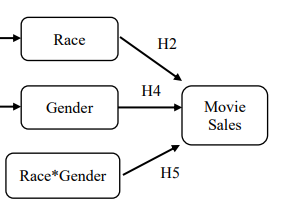

# Film in Colour

This project explores the impact of the leading cast's diversity on Hollywood movie box office performance, aiming to replicate the findings of Xing Fan's (2021) master's thesis and conducting additional analyses.

### Introduction

The underrepresentation of racial minorities and women in Hollywood movie top acting positions is an ongoing problem according to various researchers (Harris, 2016; Roxborough, 2016; Moore, & Coleman, 2015). While film producers care about the factors influencing movie market performance, there has been a lack of comprehensive exploration regarding the influence of the participation of racial minorities and women on movie sales. Xing Fan claims to be the first researcher to explore how the racial and gender identity of top actors can affect movie sales via regression analysis. The first hypothesis is that movie budget is the driver of the cast's racial diversity and age is the driver of the cast's gender diversity. The next hypothesis is that the interaction of race and gender has a significant impact on movie market performance.

### Hypotheses
Specifically, this project investigates:
- _H2: The movie market performance is negatively related to the ratio of White actors in the movie leading cast._
- _H4: The movie market performance is negatively related to the ratio of female actors in the movie leading cast._
- _H5: The interaction of the ratio of actors from different ethnicities and the ratio of women has a significant impact on movie market performance._



### Process - need to do
- add notes on process

### Installation instructions for user - need to do
- words
- bash

### Installation instructions for contributors

- Find a link to the Fan, X., 2021 study here: [Fan, X., 2021](https://atrium.lib.uoguelph.ca/server/api/core/bitstreams/6c82a2c1-57ba-4963-b09e-3942e3410421/content)
- Download the dataset from kaggle here: [IMDB 5000 Movie Dataset](https://www.kaggle.com/datasets/carolzhangdc/imdb-5000-movie-dataset)

### Suggestions for contributors and future analyses
The points below are suggestions for contributors to enhance this research:
- Improve the quality of the sample size from the top 10 highest budgeting movies per year to the highest 30 budgeting movies per year
- Incorporate further control variables such as release season (cite), movie duration, and IMDB movie score
- Investigate ethnicity as the independent variable as a more nuance substitute for race
- Investigate sexuality as an independent variable

### List of known issues
- The sample size used is one third of the sample used by Xing Fan, leading to the inability to replicate exact results

### References
Fan, X., (2021). The Influence of Movie Main Cast’s Diversity on Attendance (Doctoral dissertation, University of Guelph). Available at: https://atrium.lib.uoguelph.ca/server/api/core/bitstreams/6c82a2c1-57ba-4963-b09e-3942e3410421/content (Accessed: 27/12/2023)

Harris, A. (2016). Industry Folks Are Really Trying to Make the “Diversity Doesn’t Sell Overseas” Mantra Happen. [online] Available at: http://www.slate.com/blogs/browbeat/2016/03/30/the_hollywood_reporter_on_empire_s_global_ratings_is_the_latest_attempt.html (Accessed: 27/12/2023)

Moore, E. E., & Coleman, C. (2015). Starving for diversity: Ideological implications of race representations in The Hunger Games. _The Journal of Popular Culture_, 48(5), 948. Available at: https://digitalcommons.tacoma.uw.edu/cgi/viewcontent.cgi?article=1785&context=ias_pub (Accessed: 27/12/2023)

Roxborough, S. (2016). America’s TV Exports Too Diverse for Overseas. [online] Available at: http://www.hollywoodreporter.com/news/americas-tv-exports-diverse-overseas-879109 (Accessed: 27/12/2023)


### ALL OF THE STUFF BELOW ARE MATTS TEMPLATE - WILL DELETE

```bash
pip3 install -r build_requirements.txt
```

This will install all the prerequisites.

To fetch the data, run:

```bash
python3 fetch_data.py
```

To build the book, run:

```
jupyter-book build .
```

The book build appears in the `_build/html` directory.  You can open it with your browser.
