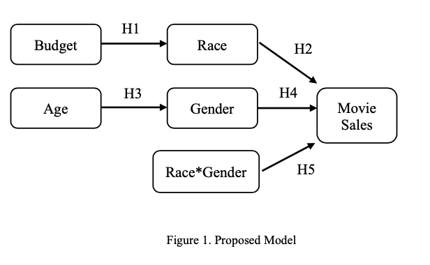

# Project Film in Colour

## Diversity on Screen: Unraveling the Impact of Minority Representation in Film on Consumer Attitudes and Industry Practices

### Introduction

Research consistently shows that minorities, including racial and ethnic groups, women, and disabled groups, are underrepresented in the film industry (Iasiello, 2017; Eschholz, 2002; Karniouchina, 2023). This underrepresentation is evident in both leading roles and directorial positions, where employers often attribute the root of bias to consumer attitudes rather than organizational practices, explained by individual preference for racial and ethnic similarity within networks, as well as systemic issues such as lack of opportunities and outcomes for women and racial/ethnic minorities (Iasiello, 2017; Iasiello, 2020; Erigha, 2015). 

This underrepresentation carries substantial social and economic implications, potentially perpetuating discrimination and harmful stereotypes. It restricts the range of narratives available to society about diverse groups, thereby shaping perceptions over time. The empirical challenge of testing the influence and scope of consumer racial attitudes on purchasing decisions has constrained prior efforts to disentangle managerial bias from consumer bias (Kuppaswamy, 2018).

In this study, we expand upon research regarding consumer reactions to workforce diversity in the film industry, utilizing an intersectional data analysis approach. We replicate and build upon Xi Fang's 2021 study from The University of Guelph, which evaluated U.S. film performance in relation to race and gender diversity of casts (Fang, 2021). Our work further investigates the impact of diversity on viewing hours on Netflix. Moreover, we explore consumer discrimination nuances by examining the variability of responses to main cast diversity across different movie genres, using mixed effects modeling. This approach broadens our understanding of the social contexts in which consumer discrimination operates.

## Replication Process

Fang used the Ordinary Least Squared (OLS) Linear Regression technique utilizing a control function, which separately models all control variables, to explore five different hypotheses within his research, (see below), his results rejected all null hypotheses.  

- **H1:** The ratio of White actors in movie leading cast is positively related to the movie budget.
- **H2:** The movie market performance is negatively related to the ratio of White actors in the movie leading cast.
- **H3:** The ratio of women in the movie leading cast is negatively related to the average age of the leading cast.
- **H4:** The movie market performance is negatively related to the ratio of female actors in the movie leading cast.
- **H5:** The interaction of the ratio of actors from different ethnicities and the ratio of women has a significant impact on movie market performance.



**Given the unsurprising implications of H1 and H3, we chose to explore the direct effects of the leading cast's diversity on movie market performance, H2, H4, and H5.**

### Data Replication

**Movie Data:** Fang used the IMDB 5000 dataset from the Kaggle website. It contains 28 variables for the top-rated 5043 movies, spanning across 100 years in 66 countries for the year 2007-2016. He used the gross values from this dataset to calculate attendance by dividing gross revenue by average ticket price in each year, using U.S. average movie ticket price data from 2007 to 2016 in Statista (https://www.statista.com).

**Demographic Data:** Fang collected race, gender, and age information of actors using NNDB (https://www.nndb.com), where celebrities’ gender, race, birthday, and nationality information is aggregated as well as Kairos, a facial recognition ML API (https://www.kairos.com) to identify casts’ race, gender, and age by their photos on their IMDb personal page.

**Differences in our data collection process:** Fang selected the top 30 films per year from 2006-17; due to time constraints, we selected the top 10 films per year. We chose not to use the Kairos ML facial recognition due to low confidence levels and the bias of the black-box algorithm, preferring as researchers to make categorizing decisions and reflect on our biases.

### Replication Cleaning Page
This page is our cleaning process.


### Read the data


```python
#IMPORT LIBRARIES

import pandas as pd
pd.set_option('display.max_rows', 20)
pd.set_option('mode.copy_on_write', True)


#READ THE DATA
df = pd.read_csv("data/movie_metadata.csv")
df.head()
```


<div>
<style scoped>
    .dataframe tbody tr th:only-of-type {
        vertical-align: middle;
    }

    .dataframe tbody tr th {
        vertical-align: top;
    }

    .dataframe thead th {
        text-align: right;
    }
</style>
<table border="1" class="dataframe">
  <thead>
    <tr style="text-align: right;">
      <th></th>
      <th>color</th>
      <th>director_name</th>
      <th>num_critic_for_reviews</th>
      <th>duration</th>
      <th>director_facebook_likes</th>
      <th>actor_3_facebook_likes</th>
      <th>actor_2_name</th>
      <th>actor_1_facebook_likes</th>
      <th>gross</th>
      <th>genres</th>
      <th>...</th>
      <th>num_user_for_reviews</th>
      <th>language</th>
      <th>country</th>
      <th>content_rating</th>
      <th>budget</th>
      <th>title_year</th>
      <th>actor_2_facebook_likes</th>
      <th>imdb_score</th>
      <th>aspect_ratio</th>
      <th>movie_facebook_likes</th>
    </tr>
  </thead>
  <tbody>
    <tr>
      <th>0</th>
      <td>Color</td>
      <td>James Cameron</td>
      <td>723.0</td>
      <td>178.0</td>
      <td>0.0</td>
      <td>855.0</td>
      <td>Joel David Moore</td>
      <td>1000.0</td>
      <td>760505847.0</td>
      <td>Action|Adventure|Fantasy|Sci-Fi</td>
      <td>...</td>
      <td>3054.0</td>
      <td>English</td>
      <td>USA</td>
      <td>PG-13</td>
      <td>237000000.0</td>
      <td>2009.0</td>
      <td>936.0</td>
      <td>7.9</td>
      <td>1.78</td>
      <td>33000</td>
    </tr>
    <tr>
      <th>1</th>
      <td>Color</td>
      <td>Gore Verbinski</td>
      <td>302.0</td>
      <td>169.0</td>
      <td>563.0</td>
      <td>1000.0</td>
      <td>Orlando Bloom</td>
      <td>40000.0</td>
      <td>309404152.0</td>
      <td>Action|Adventure|Fantasy</td>
      <td>...</td>
      <td>1238.0</td>
      <td>English</td>
      <td>USA</td>
      <td>PG-13</td>
      <td>300000000.0</td>
      <td>2007.0</td>
      <td>5000.0</td>
      <td>7.1</td>
      <td>2.35</td>
      <td>0</td>
    </tr>
    <tr>
      <th>2</th>
      <td>Color</td>
      <td>Sam Mendes</td>
      <td>602.0</td>
      <td>148.0</td>
      <td>0.0</td>
      <td>161.0</td>
      <td>Rory Kinnear</td>
      <td>11000.0</td>
      <td>200074175.0</td>
      <td>Action|Adventure|Thriller</td>
      <td>...</td>
      <td>994.0</td>
      <td>English</td>
      <td>UK</td>
      <td>PG-13</td>
      <td>245000000.0</td>
      <td>2015.0</td>
      <td>393.0</td>
      <td>6.8</td>
      <td>2.35</td>
      <td>85000</td>
    </tr>
    <tr>
      <th>3</th>
      <td>Color</td>
      <td>Christopher Nolan</td>
      <td>813.0</td>
      <td>164.0</td>
      <td>22000.0</td>
      <td>23000.0</td>
      <td>Christian Bale</td>
      <td>27000.0</td>
      <td>448130642.0</td>
      <td>Action|Thriller</td>
      <td>...</td>
      <td>2701.0</td>
      <td>English</td>
      <td>USA</td>
      <td>PG-13</td>
      <td>250000000.0</td>
      <td>2012.0</td>
      <td>23000.0</td>
      <td>8.5</td>
      <td>2.35</td>
      <td>164000</td>
    </tr>
    <tr>
      <th>4</th>
      <td>NaN</td>
      <td>Doug Walker</td>
      <td>NaN</td>
      <td>NaN</td>
      <td>131.0</td>
      <td>NaN</td>
      <td>Rob Walker</td>
      <td>131.0</td>
      <td>NaN</td>
      <td>Documentary</td>
      <td>...</td>
      <td>NaN</td>
      <td>NaN</td>
      <td>NaN</td>
      <td>NaN</td>
      <td>NaN</td>
      <td>NaN</td>
      <td>12.0</td>
      <td>7.1</td>
      <td>NaN</td>
      <td>0</td>
    </tr>
  </tbody>
</table>
<p>5 rows × 28 columns</p>
</div>


### Data Preprocessing: Cleaning and Preparing Variables

#### IMDB 5000 Dataset


```python
#START REPLICATION
#creating a new filtered df with only the years 2006-2017
filtered_df = df[(df['title_year'] >= 2007) & (df['title_year'] <= 2016)]

#drop duplicate films
filtered_df.drop_duplicates(subset='movie_title', inplace = True)

#drop animated films
filtered_df.drop(filtered_df[filtered_df['genres'].str.contains('Animation', na=False)].index, inplace=True)

#dropna for gross and movie title
filtered_df.dropna(subset=['movie_title', 'gross'], inplace=True)

#drop values for films not in the USA
filtered_df.drop(filtered_df[filtered_df['country'] != 'USA'].index, inplace=True)

#drop values without english as the original language
filtered_df.drop(filtered_df[filtered_df['language'] != 'English'].index, inplace=True)

#drop all rows without revenue data
filtered_df.drop(filtered_df[filtered_df['gross'] == 0].index, inplace=True)
```

#### Filling in missing budget values

Manually create a dictionary and find the missing budget data using [The Numbers](https://www.the-numbers.com/market/)  


```python
#finds films with no budget values
zero_budget = filtered_df[pd.isna(filtered_df['budget'])]

#create new df for films with no budget
zero_budget_df = zero_budget[[ 'movie_title', 'title_year']].copy()

#strip white space
zero_budget_df['movie_title'] = zero_budget_df['movie_title'].str.strip().astype(str)

#budget dictionary
#manually add budget using data from TheNumbers.com
#create a dictionary with movie titles as keys and research budget values as values
budget_dict = {
    'The Campaign': 86907746,
    'Carriers': 120866,
    'Wild Hogs': 168213584,
    'Semi-Pro': 33479698,
    'Lucky You': 5755286,
    'Anna Karenina': 12816367,
    'Here Comes the Boom': 45290318,
    'The Odd Life of Timothy Green': 51853450,
    'Because I Said So': 42674040,
    'Get on Up': 30569935,
    'Dead Man Down': 10895295,
    'Hot Rod': 13938332,
    'Cirque du Soleil: Worlds Away': 12512862,
    'For Colored Girls': 37729698,
    'Strange Wilderness': 6575282,
    'Regression': 55039,
    'The Book Thief': 21488481,
    "Won't Back Down": 5310554,
    'Observe and Report': 24007324,
    'Madea Goes to Jail': 90508336,
    'McFarland, USA': 44480275,
    'Mr. Turner': 3958546,
    'Top Five': 25317379,
    'Just Wright': 21540363,
    'About Time': 15323921,
    'Cedar Rapids' : 6861102,
    'The Collection': 6810754,	
    'Welcome to the Rileys': 152857,
    'Free Style': 141108,
    'Repo! The Genetic Opera': 140244,
    'Enough Said': 17550872,
    'When Did You Last See Your Father?': 1071240,
    'Definitely, Maybe':32241649,
    'Dom Hemingway' : 523511,
    'Control' : 871577,
    'The Art of Getting By': 1430241,
    'Adam' : 2283291,
    'Slow West' : 2290194,
    'Frances Ha' : 4067398,
    'Kevin Hart: Let Me Explain': 32244051,
    "Meek's Cutoff" : 977772,
    'Eden Lake' : 7321,
    'Submarine': 467602,
    'Man on Wire' : 2962242,
    'Snow Angels': 402858,
    'The Greatest Movie Ever Sold': 638476,
    'Mooz-lum' : 362239,
    'Eddie: The Sleepwalking Cannibal': 1632,
    'Chernobyl Diaries' : 18119640,
    'October Baby' : 5355847,
    'The Skeleton Twins' : 5284309,
    'Martha Marcy May Marlene': 2981038,
    'Obvious Child' : 3122616,
    'I Origins' : 336472,
    'The Perfect Host' : 48764,
    'Fruitvale Station' : 16098998,
    'Celeste & Jesse Forever': 3103407,
    'Drinking Buddies' : 343706,
    'Good Kill' : 317072,
    'Blue Ruin' : 258384,
    'Compliance' :319285,
    'The Finest Hours': 27569558,
    'Dinner for Schmucks': 73026337,
    'State of Play': 37017955,
    'Trouble with the Curve': 35763137,
    'We Bought a Zoo': 75624550,
    'Get Him to the Greek' : 61153526,
    'Music and Lyrics': 50572589,
    'Soul Men' : 12082391,
    'Because I Said So': 42674040,
    'Wanderlust': 17288155,
    'The Three Stooges'	: 44338224,
    'The Sitter': 30542576,
    'Hot Rod': 13938332, 
    'Cirque du Soleil: Worlds Away': 12512862,
    'In the Valley of Elah': 6777741,
    'For Colored Girls': 37729698,
    'Orphan': 41596251,
    'The Stepfather':29062561,
    'Appaloosa': 20211394,
    'Capitalism: A Love Story': 14363397,
    'All Good Things':582024,
    'Metallica Through the Never': 3419967,
    'Lottery Ticket' :24719879,
    'U2 3D' : 12898847,
    'Blood and Chocolate': 3526588,
    'I Think I Love My Wife': 12559771,
    'Rachel Getting Married' :12769861,
    'Darling Companion': 793352,
    'The Goods: Live Hard, Sell Hard': 15122676,
    "World's Greatest Dad": 221805,	
    'Blood Done Sign My Name':109383,
    'Adventureland': 16044025,	
    'Gentlemen Broncos': 115155,	
    'The Savages' : 6623082,
    'I Hope They Serve Beer in Hell': 1429299,	
    'Trade of Innocents': 15091,	
    'Standing Ovation': 531806,	
    'Standard Operating Procedure': 228830,	
    'Life During Wartime': 281447, 
    'Please Give': 4033574,	
    'Damsels in Distress': 1007535,	
    'Redemption Road': 29384,
    'Inside Job': 4311834,	
    'Teeth': 347578,
    'The Last Five Years': 147299,	
    'Plush': 3080,
    'Supercapitalist': 15919,
    'All Is Bright': 4556,
    'Higher Ground': 841056,	
    'Grace Unplugged': 2507159,	
    'N-Secure': 2595644,	
    'Shine a Light': 5505267,	
    'Food, Inc.': 4417674,	
    'Palo Alto': 767732,	
    'Kevin Hart: Laugh at My Pain': 7706436,	
    'Escape from Tomorrow': 171962,
    'Water & Power': 42557,	
    'The Looking Glass': 1711,
    'Shotgun Stories':  46026,
    'Good Dick':28835,	
    'Sound of My Voice': 408015,	
    'The Exploding Girl': 25572,	
    'Shanghai Calling': 10443,
    }


# Create a new column for 'estimate budget' and map the dictionary to fill the missing values
zero_budget_df['estimate budget'] = zero_budget_df['movie_title'].map(budget_dict)

#map onto the cleaned dataframe
filtered_df['movie_title'] = filtered_df['movie_title'].str.strip().astype(str)
filtered_df['budget'] = filtered_df['budget'].fillna(filtered_df['movie_title'].map(budget_dict))

#drop the Nan value
filtered_df = filtered_df.dropna(subset=['budget'])
```

#### Find top 10 films per year with the highest budget

Limitation note: Xing Fan used the top 30 films with the highest budget per year. Due to scope, we have reduced our sample to 10. This will limit our ability to replicate completely.


```python
#groupby year and find top 10 films with highest budget
top10_by_year = filtered_df.groupby('title_year').apply(lambda group: group.nlargest(10, 'budget'))

#create top actors df with top 10 films
top_actors = top10_by_year.loc[:,['movie_title','title_year','content_rating','actor_1_name','actor_2_name','actor_3_name', 'budget','gross', 'genres']]
top_actors.reset_index(drop=True, inplace=True)
top_actors['actor_1_name'].str.strip()
top_actors['actor_2_name'].str.strip()
top_actors['actor_3_name'].str.strip()
top_actors['movie_title'].str.strip()
```


    0     Pirates of the Caribbean: At World's End
    1                                 Spider-Man 3
    2                           The Golden Compass
    3                                Evan Almighty
    4                                    Wild Hogs
                            ...                   
    95                               Suicide Squad
    96             Alice Through the Looking Glass
    97                Independence Day: Resurgence
    98                                    Warcraft
    99                                Ghostbusters
    Name: movie_title, Length: 100, dtype: object


### Actor Diversity Data Collection

Manual collection using IMDB Pro. 

Note: Xing Fan used machine learning to identify race into the following categories; White, Black, Asian, Hispanic, Other. We chose to omit the machine learning process and decide racial identity based off the information available on the actors IMDB Pro 'about' page, cross referencing with other sites such as Wikipedia and the actors social media pages when race was ambiguous.

#### Building the diversity dictionary
Key = Actor name

Value 1 = Gender

Value 2 = Race

Value 3 = Birth Year


```python
# Unique actors dictionary
# Name: Gender(F/N/M), Race (W/B/H/A/O), Birth Year
diversity_dict = {
    'Liam James': ('M', 'W', 1996),
    'Tom McCarthy': ('M', 'W', 1966),
    'Cary-Hiroyuki Tagawa': ('M', 'A', 1950),
    'Keanu Reeves': ('M', 'O', 1964),
    'Jin Akanishi': ('M', 'A', 1984),
    'Ayelet Zurer': ('F', 'O', 1969),
    'Tom Hanks': ('M', 'W', 1956),
    'Armin Mueller-Stahl': ('M', 'W', 1930),
    'T.I.': ('M', 'B', 1980),
    'CCH Pounder': ('F', 'B', 1952),
    'Wes Studi': ('M', 'A', 1947),
    'Joel David Moore': ('M', 'W', 1977),
    'Alan D. Purwin': ('M', 'W', 1961),
    'Lauren Cohan': ('F', 'W', 1982),
    'Tadanobu Asano': ('M', 'A', 1973),
    'Gary Oldman': ('M', 'W', 1958),
    'Kodi Smit-McPhee': ('M', 'W', 1996),
    'Lara Pulver': ('F', 'W', 1980),
    'Noah Taylor': ('M', 'W', 1969),
    'Steve Carell': ('M', 'W', 1962),
    'Jimmy Bennett': ('M', 'W', 1996),
    'Andre Braugher': ('M', 'B', 1962),
    'Ioan Gruffudd': ('M', 'W', 1973),
    'Dwayne Johnson': ('M', 'O', 1972),
    'Jason Statham': ('M', 'W', 1967),
    'Dennis Quaid': ('M', 'W', 1954),
    'Leo Howard': ('M', 'W', 1997),
    'Peter Fonda': ('M', 'W', 1940),
    'Matt Long': ('M', 'W', 1980),
    'Kate McKinnon': ('F', 'W', 1984),
    'Ed Begley Jr.': ('M', 'W', 1949),
    'Zach Woods': ('M', 'O', 1984),
    'Temuera Morrison': ('M', 'O', 1960),
    'Taika Waititi': ('M', 'O', 1975),
    'Djimon Hounsou': ('M', 'B', 1964),
    'Bradley Cooper': ('M', 'W', 1975),
    'Chloë Grace Moretz': ('F', 'W', 1997),
    'Willow Smith': ('F', 'B', 2000),
    'Alice Braga': ('F', 'H', 1983),
    'Vivica A. Fox': ('F', 'B', 1964),
    'Judd Hirsch': ('M', 'W', 1935),
    'Sela Ward': ('F', 'W', 1956),
    'Harrison Ford': ('M', 'W', 1942),
    'Jim Broadbent': ('M', 'W', 1949),
    'Mackenzie Foy': ('F', 'W', 2000),
    'Matthew McConaughey': ('M', 'W', 1969),
    'Don Cheadle': ('M', 'B', 1964),
    'Ewen Bremner': ('M', 'W', 1972),
    'Ralph Brown': ('M', 'W', 1957),
    'Daryl Sabara': ('M', 'W', 1992),
    'Samantha Morton': ('F', 'W', 1977),
    'Polly Walker': ('F', 'W', 1966),
    'Eddie Redmayne': ('M', 'W', 1982),
    'Channing Tatum': ('M', 'W', 1980),
    'Omar Sy': ('M', 'B', 1978),
    'Sharlto Copley': ('M', 'W', 1973),
    'Angelina Jolie Pitt': ('F', 'W', 1975),
    'Sam Riley': ('M', 'W', 1980),
    'Christopher Meloni': ('M', 'W', 1961),
    'Harry Lennix': ('M', 'B', 1964),
    'Nicole Scherzinger': ('F', 'O', 1978),
    'Michael Stuhlbarg': ('M', 'W', 1968),
    'Michael Nyqvist': ('M', 'W', 1960),
    'Jeremy Renner': ('M', 'W', 1971),
    'Tim Holmes': ('M', 'W', 1967),
    'Larry Joe Campbell': ('M', 'W', 1970),
    'Clifton Collins Jr.': ('M', 'H', 1970),
    'Charlie Hunnam': ('M', 'W', 1980),
    'Nonso Anozie': ('M', 'B', 1978),
    'Cara Delevingne': ('F', 'W', 1992),
    'Orlando Bloom': ('M', 'W', 1977),
    'Jack Davenport': ('M', 'W', 1973),
    'Stephen Graham': ('M', 'W', 1973),
    'Jake Gyllenhaal': ('M', 'W', 1980),
    'Richard Coyle': ('M', 'W', 1972),
    'Reece Ritchie': ('M', 'W', 1986),
    'Sean Harris': ('M', 'W', 1966),
    'Scott Grimes': ('M', 'W', 1971),
    'Mark Addy': ('M', 'W', 1964),
    'Tzi Ma': ('M', 'A', 1962),
    'Noémie Lenoir': ('F', 'O', 1979),
    'Dana Ivey': ('F', 'W', 1941),
    'Kristen Stewart': ('F', 'W', 1990),
    'Nicholas Elia': ('M', 'W', 1997),
    'Scott Porter': ('M', 'W', 1979),
    'Kick Gurry': ('M', 'W', 1978),
    'Kirsten Dunst': ('F', 'W', 1982),
    'Lydia Wilson': ('F', 'W', 1984),
    'Sofia Boutella': ('F', 'O', 1982),
    'Melissa Roxburgh': ('F', 'W', 1992),
    'Noel Clarke': ('M', 'B', 1975),
    'Benedict Cumberbatch': ('M', 'W', 1976),
    'Leonard Nimoy': ('M', 'W', 1931),
    'Robin Atkin Downes': ('M', 'W', 1976),
    'Ike Barinholtz': ('M', 'W', 1977),
    'James Frain': ('M', 'W', 1968),
    'Olivia Wilde': ('F', 'W', 1984),
    'Emilia Clarke': ('F', 'W', 1986),
    'Matt Smith': ('M', 'W', 1982),
    'Common': ('M', 'B', 1972),
    'Tony Curran': ('M', 'W', 1969),
    'Mackenzie Crook': ('M', 'W', 1971),
    'Toby Jones': ('M', 'W', 1966),
    'B.J. Novak': ('M', 'W', 1979),
    'Chris Zylka': ('M', 'W', 1985),
    'Matt Damon': ('M', 'W', 1970),
    'Albert Finney': ('M', 'W', 1936),
    'Pierfrancesco Favino': ('M', 'W', 1969),
    'Damián Alcázar': ('M', 'H', 1953),
    'Shane Rangi': ('M', 'O', 1969),
    'Laura Brent': ('F', 'W', 1988),
    'Bruce Spence': ('M', 'W', 1945),
    'Jason Flemyng': ('M', 'W', 1966),
    'Julia Ormond': ('F', 'W', 1965),
    'Heath Ledger': ('M', 'W', 1979),
    'Kristin Scott Thomas': ('F', 'W', 1960),
    'Eva Green': ('F', 'W', 1980),
    'Josh Hutcherson': ('M', 'W', 1992),
    'Philip Seymour Hoffman': ('M', 'W', 2014),
    'Peter Mensah': ('M', 'B', 1959),
    'Ty Burrell': ('M', 'W', 1967),
    'Aasif Mandvi': ('M', 'A', 1966),
    'Seychelle Gabriel': ('F', 'H', 1991),
    'Noah Ringer': ('M', 'W', 1996),
    'Christoph Waltz': ('M', 'W', 1956),
    'Casper Crump': ('M', 'W', 1977),
    'Ruth Wilson': ('F', 'W', 1982),
    'Tom Wilkinson': ('M', 'W', 1948),
    'Jet Li': ('M', 'A', 1963),
    'Brendan Fraser': ('M', 'W', 1968),
    'Russell Wong': ('M', 'A', 1963),
    'Lukas Haas': ('M', 'W', 1976),
    'Omar Benson Miller': ('M', 'B', 1978),
    'Robert Capron': ('M', 'W', 1998),
    'Art Malik': ('M', 'A', 1952),
    'Simon Merrells': ('M', 'W', 1965),
    'Natalie Portman': ('F', 'O', 1981),
    'Thomas Robinson': ('M', 'W', 2002),
    'Chris Bauer': ('M', 'W', 1966),
    'Sophia Myles': ('F','W',1980),
    'Bingbing Li': ('F','A',1973),
    'Kelsey Grammer': ('M','W',1955),
    'Lester Speight': ('M','B',1963),
    'Ramon Rodriguez': ('M','H',1979),
    "Michael O'Neill": ('M','W',1951),
    'Zack Ward': ('M','W',1970),
    'Brandon T. Jackson': ('M','B',1984),
    'Callum Rennie': ('M','W',1960),
    'Ruth Negga': ('F','O',1982),
    'Stephen McHattie': ('M','W',1947),
    'Billy Crudup': ('M','W',1968),
    'Matt Frewer': ('M','W',1958),
    'Peter Capaldi': ('M','W',1958),
    'Mireille Enos': ('F','W',1975),
    'Lily James': ('F','W',1989),
    'Dominic Monaghan': ('M','W',1976),
    'Tye Sheridan': ('M','W',1996),
    'Jill Hennessy': ('F', 'W', 1968),
    'Tichina Arnold': ('F', 'B', 1969),
    'Drew Sidora': ('F', 'B', 1985),
    'Johnny Depp': ('M', 'W', 1963),
    'J.K. Simmons': ('M', 'W', 1955),
    'Christopher Lee': ('M', 'W', 1922),
    'Will Smith': ('M', 'B', 1968),
    'Chris Evans': ('M', 'W', 1981),
    'Nicolas Cage': ('M', 'W', 1964),
    'Peter Dinklage': ('M', 'W', 1969),
    'Christian Bale': ('M', 'W', 1974),
    'Brad Pitt': ('M', 'W', 1963),
    'Robert Downey Jr.': ('M', 'W', 1965),
    'Glenn Morshower': ('M', 'W', 1959),
    'Oliver Platt': ('M', 'W', 1960),
    'Joseph Gordon-Levitt': ('M', 'W', 1981),
    'Robin Williams': ('M', 'W', 1951),
    'Hugh Jackman': ('M', 'W', 1968),
    'Chris Hemsworth':('M', 'W', 1983),
    'Jeff Bridges': ('M', 'W', 1949),
    'Leonardo DiCaprio': ('M', 'W', 1974),
    'Anthony Hopkins': ('M', 'W', 1937),
    'Ryan Reynolds': ('M', 'W', 1937),
    'Jennifer Lawrence': ('F', 'W',1990),
    'Tom Cruise': ('M', 'W', 1962),
    'Paul Walker': ('M', 'W', 1973),
    'Tom Hardy': ('M', 'W', 1977),
    'Emma Stone':('F', 'W', 1988),
    'Liam Neeson': ('M', 'W', 1952),
    'Aidan Turner': ('M', 'W', 1977),
    'Michael Fassbender':('M', 'W', 1977),
    'Henry Cavill': ('M', 'W', 1983),
    'Eddie Marsan':('M', 'W', 1968),
    'Scarlett Johansson': ('F', 'W', 1984),
    'Judy Greer': ('F', 'W', 1975),
    'Bryce Dallas Howard': ('F', 'W', 1981),
    'Dominic Cooper':('M', 'W', 1978),
    'James Franco':('M', 'W', 1978),
    'Morgan Freeman': ('M', 'B', 1937),
    'Edgar Ramírez':('M', 'H', 1977),
    'Ray Winstone':('M', 'W', 1957),
    'Charlize Theron': ('F', 'W', 1975),
    'Steve Coogan': ('M', 'W', 1965),
    'Kevin Dunn':('M', 'W', 1956),
    'Rami Malek': ('M', 'W', 1981),
    'William Hurt':('M', 'W', 1950),
    'Alan Rickman': ('M', 'W', 1946),
    'Sam Claflin':('M', 'W', 1986),
    'Vin Diesel': ('M', 'W', 1967),
    'Andrew Garfield': ('M', 'W', 1983),
    'Alexander Skarsgård': ('M', 'W', 1976),
    'Adam Brown':('M', 'W', 1980),
    'Mila Kunis': ('F', 'W', 1983),
    'Jon Favreau': ('M', 'W', 1966),
    'Bruce Greenwood':('M', 'W', 1956),
    'Anne Hathaway': ('F', 'W', 1982),
    'Hayley Atwell':('F', 'W', 1982),
    'James Nesbitt':('M', 'W', 1965)
}

```

#### Function to populate the diversity data from the dictionary to the top_actors df


```python
#function to find the actors diversity data according to row
def get_combined_info(row, info_index):
    actor_list = [row['actor_1_name'], row['actor_2_name'], row['actor_3_name']]
    info_list = []
    for actor in actor_list:
        if actor in diversity_dict:
            info_list.append(diversity_dict[actor][info_index])
        else:
            info_list.append('Unknown')
    return info_list

#apply function to new columns in top_actors df
top_actors['genders'] = top_actors.apply(lambda row: get_combined_info(row, 0), axis=1)
top_actors['race'] = top_actors.apply(lambda row: get_combined_info(row, 1), axis=1)
top_actors['birth_year'] = top_actors.apply(lambda row: get_combined_info(row, 2), axis=1)

#display
top_actors
```


<div>
<style scoped>
    .dataframe tbody tr th:only-of-type {
        vertical-align: middle;
    }

    .dataframe tbody tr th {
        vertical-align: top;
    }

    .dataframe thead th {
        text-align: right;
    }
</style>
<table border="1" class="dataframe">
  <thead>
    <tr style="text-align: right;">
      <th></th>
      <th>movie_title</th>
      <th>title_year</th>
      <th>content_rating</th>
      <th>actor_1_name</th>
      <th>actor_2_name</th>
      <th>actor_3_name</th>
      <th>budget</th>
      <th>gross</th>
      <th>genres</th>
      <th>genders</th>
      <th>race</th>
      <th>birth_year</th>
    </tr>
  </thead>
  <tbody>
    <tr>
      <th>0</th>
      <td>Pirates of the Caribbean: At World's End</td>
      <td>2007.0</td>
      <td>PG-13</td>
      <td>Johnny Depp</td>
      <td>Orlando Bloom</td>
      <td>Jack Davenport</td>
      <td>300000000.0</td>
      <td>309404152.0</td>
      <td>Action|Adventure|Fantasy</td>
      <td>[M, M, M]</td>
      <td>[W, W, W]</td>
      <td>[1963, 1977, 1973]</td>
    </tr>
    <tr>
      <th>1</th>
      <td>Spider-Man 3</td>
      <td>2007.0</td>
      <td>PG-13</td>
      <td>J.K. Simmons</td>
      <td>James Franco</td>
      <td>Kirsten Dunst</td>
      <td>258000000.0</td>
      <td>336530303.0</td>
      <td>Action|Adventure|Romance</td>
      <td>[M, M, F]</td>
      <td>[W, W, W]</td>
      <td>[1955, 1978, 1982]</td>
    </tr>
    <tr>
      <th>2</th>
      <td>The Golden Compass</td>
      <td>2007.0</td>
      <td>PG-13</td>
      <td>Christopher Lee</td>
      <td>Eva Green</td>
      <td>Kristin Scott Thomas</td>
      <td>180000000.0</td>
      <td>70083519.0</td>
      <td>Adventure|Family|Fantasy</td>
      <td>[M, F, F]</td>
      <td>[W, W, W]</td>
      <td>[1922, 1980, 1960]</td>
    </tr>
    <tr>
      <th>3</th>
      <td>Evan Almighty</td>
      <td>2007.0</td>
      <td>PG</td>
      <td>Jimmy Bennett</td>
      <td>Morgan Freeman</td>
      <td>Steve Carell</td>
      <td>175000000.0</td>
      <td>100289690.0</td>
      <td>Comedy|Family|Fantasy</td>
      <td>[M, M, M]</td>
      <td>[W, B, W]</td>
      <td>[1996, 1937, 1962]</td>
    </tr>
    <tr>
      <th>4</th>
      <td>Wild Hogs</td>
      <td>2007.0</td>
      <td>PG-13</td>
      <td>Jill Hennessy</td>
      <td>Tichina Arnold</td>
      <td>Drew Sidora</td>
      <td>168213584.0</td>
      <td>168213584.0</td>
      <td>Action|Adventure|Comedy</td>
      <td>[F, F, F]</td>
      <td>[W, B, B]</td>
      <td>[1968, 1969, 1985]</td>
    </tr>
    <tr>
      <th>...</th>
      <td>...</td>
      <td>...</td>
      <td>...</td>
      <td>...</td>
      <td>...</td>
      <td>...</td>
      <td>...</td>
      <td>...</td>
      <td>...</td>
      <td>...</td>
      <td>...</td>
      <td>...</td>
    </tr>
    <tr>
      <th>95</th>
      <td>Suicide Squad</td>
      <td>2016.0</td>
      <td>PG-13</td>
      <td>Will Smith</td>
      <td>Robin Atkin Downes</td>
      <td>Ike Barinholtz</td>
      <td>175000000.0</td>
      <td>161087183.0</td>
      <td>Action|Adventure|Comedy|Sci-Fi</td>
      <td>[M, M, M]</td>
      <td>[B, W, W]</td>
      <td>[1968, 1976, 1977]</td>
    </tr>
    <tr>
      <th>96</th>
      <td>Alice Through the Looking Glass</td>
      <td>2016.0</td>
      <td>PG</td>
      <td>Johnny Depp</td>
      <td>Alan Rickman</td>
      <td>Anne Hathaway</td>
      <td>170000000.0</td>
      <td>76846624.0</td>
      <td>Adventure|Family|Fantasy</td>
      <td>[M, M, F]</td>
      <td>[W, W, W]</td>
      <td>[1963, 1946, 1982]</td>
    </tr>
    <tr>
      <th>97</th>
      <td>Independence Day: Resurgence</td>
      <td>2016.0</td>
      <td>PG-13</td>
      <td>Vivica A. Fox</td>
      <td>Sela Ward</td>
      <td>Judd Hirsch</td>
      <td>165000000.0</td>
      <td>102315545.0</td>
      <td>Action|Adventure|Sci-Fi</td>
      <td>[F, F, M]</td>
      <td>[B, W, W]</td>
      <td>[1964, 1956, 1935]</td>
    </tr>
    <tr>
      <th>98</th>
      <td>Warcraft</td>
      <td>2016.0</td>
      <td>PG-13</td>
      <td>Dominic Cooper</td>
      <td>Callum Rennie</td>
      <td>Ruth Negga</td>
      <td>160000000.0</td>
      <td>46978995.0</td>
      <td>Action|Adventure|Fantasy</td>
      <td>[M, M, F]</td>
      <td>[W, W, O]</td>
      <td>[1978, 1960, 1982]</td>
    </tr>
    <tr>
      <th>99</th>
      <td>Ghostbusters</td>
      <td>2016.0</td>
      <td>PG-13</td>
      <td>Ed Begley Jr.</td>
      <td>Kate McKinnon</td>
      <td>Zach Woods</td>
      <td>144000000.0</td>
      <td>118099659.0</td>
      <td>Action|Comedy|Fantasy|Sci-Fi</td>
      <td>[M, F, M]</td>
      <td>[W, W, O]</td>
      <td>[1949, 1984, 1984]</td>
    </tr>
  </tbody>
</table>
<p>100 rows × 12 columns</p>
</div>


#### Assertation test to ensure all the data has populated and there are no unknown values


```python
assert not any(top_actors['genders'].astype(str).eq('Unknown'))
assert not any(top_actors['race'].astype(str).eq('Unknown'))
assert not any(top_actors['birth_year'].astype(str).eq('Unknown'))
```

### Gender and Race Variables

#### Converting gender to Female Proportion

The study looks at 'female vs other'.


```python
#The female proportion of actors is calculated as the number of 'F' in each movie divided by three.
Fproportions = top_actors.genders.apply(lambda cast: cast.count('F') / 3)

#put proportions into a new column
top_actors['female_proportion'] = Fproportions
```

#### Converting race to White Proportion

The study looks at 'white vs other'.


```python
#calculate race proportion using similar lambda function
Wproportions = top_actors.race.apply(lambda cast: cast.count('W')/3)

#put proportions into a new column
top_actors['white_proportion'] = Wproportions
```


```python
#display
top_actors.head()
```


<div>
<style scoped>
    .dataframe tbody tr th:only-of-type {
        vertical-align: middle;
    }

    .dataframe tbody tr th {
        vertical-align: top;
    }

    .dataframe thead th {
        text-align: right;
    }
</style>
<table border="1" class="dataframe">
  <thead>
    <tr style="text-align: right;">
      <th></th>
      <th>movie_title</th>
      <th>title_year</th>
      <th>content_rating</th>
      <th>actor_1_name</th>
      <th>actor_2_name</th>
      <th>actor_3_name</th>
      <th>budget</th>
      <th>gross</th>
      <th>genres</th>
      <th>genders</th>
      <th>race</th>
      <th>birth_year</th>
      <th>female_proportion</th>
      <th>white_proportion</th>
    </tr>
  </thead>
  <tbody>
    <tr>
      <th>0</th>
      <td>Pirates of the Caribbean: At World's End</td>
      <td>2007.0</td>
      <td>PG-13</td>
      <td>Johnny Depp</td>
      <td>Orlando Bloom</td>
      <td>Jack Davenport</td>
      <td>300000000.0</td>
      <td>309404152.0</td>
      <td>Action|Adventure|Fantasy</td>
      <td>[M, M, M]</td>
      <td>[W, W, W]</td>
      <td>[1963, 1977, 1973]</td>
      <td>0.000000</td>
      <td>1.000000</td>
    </tr>
    <tr>
      <th>1</th>
      <td>Spider-Man 3</td>
      <td>2007.0</td>
      <td>PG-13</td>
      <td>J.K. Simmons</td>
      <td>James Franco</td>
      <td>Kirsten Dunst</td>
      <td>258000000.0</td>
      <td>336530303.0</td>
      <td>Action|Adventure|Romance</td>
      <td>[M, M, F]</td>
      <td>[W, W, W]</td>
      <td>[1955, 1978, 1982]</td>
      <td>0.333333</td>
      <td>1.000000</td>
    </tr>
    <tr>
      <th>2</th>
      <td>The Golden Compass</td>
      <td>2007.0</td>
      <td>PG-13</td>
      <td>Christopher Lee</td>
      <td>Eva Green</td>
      <td>Kristin Scott Thomas</td>
      <td>180000000.0</td>
      <td>70083519.0</td>
      <td>Adventure|Family|Fantasy</td>
      <td>[M, F, F]</td>
      <td>[W, W, W]</td>
      <td>[1922, 1980, 1960]</td>
      <td>0.666667</td>
      <td>1.000000</td>
    </tr>
    <tr>
      <th>3</th>
      <td>Evan Almighty</td>
      <td>2007.0</td>
      <td>PG</td>
      <td>Jimmy Bennett</td>
      <td>Morgan Freeman</td>
      <td>Steve Carell</td>
      <td>175000000.0</td>
      <td>100289690.0</td>
      <td>Comedy|Family|Fantasy</td>
      <td>[M, M, M]</td>
      <td>[W, B, W]</td>
      <td>[1996, 1937, 1962]</td>
      <td>0.000000</td>
      <td>0.666667</td>
    </tr>
    <tr>
      <th>4</th>
      <td>Wild Hogs</td>
      <td>2007.0</td>
      <td>PG-13</td>
      <td>Jill Hennessy</td>
      <td>Tichina Arnold</td>
      <td>Drew Sidora</td>
      <td>168213584.0</td>
      <td>168213584.0</td>
      <td>Action|Adventure|Comedy</td>
      <td>[F, F, F]</td>
      <td>[W, B, B]</td>
      <td>[1968, 1969, 1985]</td>
      <td>1.000000</td>
      <td>0.333333</td>
    </tr>
  </tbody>
</table>
</div>


### Average Age Variable

#### Calculating 'age at the time of movie' then average age for the 3 top cast per movie


```python
#function to calculate age at time of movie
def calculate_age(row):
    return [row['title_year'] - year for year in row['birth_year']]

#apply calculate_age to new column
top_actors['age_at_time_of_movie'] = top_actors.apply(calculate_age, axis=1)

#convert from float to int
top_actors['age_at_time_of_movie'] = top_actors['age_at_time_of_movie'].apply(lambda x: [int(age) for age in x])

# Apply a lambda function to create the 'average_age' column
top_actors['average_age'] = top_actors['age_at_time_of_movie'].apply(lambda age_list: sum(age_list) / len(age_list) )
#display
top_actors.head()
```


<div>
<style scoped>
    .dataframe tbody tr th:only-of-type {
        vertical-align: middle;
    }

    .dataframe tbody tr th {
        vertical-align: top;
    }

    .dataframe thead th {
        text-align: right;
    }
</style>
<table border="1" class="dataframe">
  <thead>
    <tr style="text-align: right;">
      <th></th>
      <th>movie_title</th>
      <th>title_year</th>
      <th>content_rating</th>
      <th>actor_1_name</th>
      <th>actor_2_name</th>
      <th>actor_3_name</th>
      <th>budget</th>
      <th>gross</th>
      <th>genres</th>
      <th>genders</th>
      <th>race</th>
      <th>birth_year</th>
      <th>female_proportion</th>
      <th>white_proportion</th>
      <th>age_at_time_of_movie</th>
      <th>average_age</th>
    </tr>
  </thead>
  <tbody>
    <tr>
      <th>0</th>
      <td>Pirates of the Caribbean: At World's End</td>
      <td>2007.0</td>
      <td>PG-13</td>
      <td>Johnny Depp</td>
      <td>Orlando Bloom</td>
      <td>Jack Davenport</td>
      <td>300000000.0</td>
      <td>309404152.0</td>
      <td>Action|Adventure|Fantasy</td>
      <td>[M, M, M]</td>
      <td>[W, W, W]</td>
      <td>[1963, 1977, 1973]</td>
      <td>0.000000</td>
      <td>1.000000</td>
      <td>[44, 30, 34]</td>
      <td>36.000000</td>
    </tr>
    <tr>
      <th>1</th>
      <td>Spider-Man 3</td>
      <td>2007.0</td>
      <td>PG-13</td>
      <td>J.K. Simmons</td>
      <td>James Franco</td>
      <td>Kirsten Dunst</td>
      <td>258000000.0</td>
      <td>336530303.0</td>
      <td>Action|Adventure|Romance</td>
      <td>[M, M, F]</td>
      <td>[W, W, W]</td>
      <td>[1955, 1978, 1982]</td>
      <td>0.333333</td>
      <td>1.000000</td>
      <td>[52, 29, 25]</td>
      <td>35.333333</td>
    </tr>
    <tr>
      <th>2</th>
      <td>The Golden Compass</td>
      <td>2007.0</td>
      <td>PG-13</td>
      <td>Christopher Lee</td>
      <td>Eva Green</td>
      <td>Kristin Scott Thomas</td>
      <td>180000000.0</td>
      <td>70083519.0</td>
      <td>Adventure|Family|Fantasy</td>
      <td>[M, F, F]</td>
      <td>[W, W, W]</td>
      <td>[1922, 1980, 1960]</td>
      <td>0.666667</td>
      <td>1.000000</td>
      <td>[85, 27, 47]</td>
      <td>53.000000</td>
    </tr>
    <tr>
      <th>3</th>
      <td>Evan Almighty</td>
      <td>2007.0</td>
      <td>PG</td>
      <td>Jimmy Bennett</td>
      <td>Morgan Freeman</td>
      <td>Steve Carell</td>
      <td>175000000.0</td>
      <td>100289690.0</td>
      <td>Comedy|Family|Fantasy</td>
      <td>[M, M, M]</td>
      <td>[W, B, W]</td>
      <td>[1996, 1937, 1962]</td>
      <td>0.000000</td>
      <td>0.666667</td>
      <td>[11, 70, 45]</td>
      <td>42.000000</td>
    </tr>
    <tr>
      <th>4</th>
      <td>Wild Hogs</td>
      <td>2007.0</td>
      <td>PG-13</td>
      <td>Jill Hennessy</td>
      <td>Tichina Arnold</td>
      <td>Drew Sidora</td>
      <td>168213584.0</td>
      <td>168213584.0</td>
      <td>Action|Adventure|Comedy</td>
      <td>[F, F, F]</td>
      <td>[W, B, B]</td>
      <td>[1968, 1969, 1985]</td>
      <td>1.000000</td>
      <td>0.333333</td>
      <td>[39, 38, 22]</td>
      <td>33.000000</td>
    </tr>
  </tbody>
</table>
</div>


### Attendance Variable

#### Calculating attendance (in million viewer)

We collect U.S. average movie ticket price data from 2007 to 2016 from [Statista](https://www.statista.com/) and calculate the movie attendance using domestic movie sales
divided by U.S. movie average ticket price in each year. 


```python
av_ticket_price = {
    2016: 8.65,
    2015: 8.43,
    2014: 8.17,
    2013: 8.13,
    2012: 7.96,
    2011: 7.93,
    2010: 7.89,
    2009: 7.50,
    2008: 7.18,
    2007: 6.88 }


top_actors['attendance'] = top_actors['title_year'].map(av_ticket_price)
top_actors['attendance'] = top_actors['gross'] / top_actors['attendance']

# calculate per million viewer to scale numbers down and rounded to no decimal points
top_actors['attendance_in_mills'] = (top_actors['attendance'] / 1_000_000).round(0)

#display
top_actors.head()
```


<div>
<style scoped>
    .dataframe tbody tr th:only-of-type {
        vertical-align: middle;
    }

    .dataframe tbody tr th {
        vertical-align: top;
    }

    .dataframe thead th {
        text-align: right;
    }
</style>
<table border="1" class="dataframe">
  <thead>
    <tr style="text-align: right;">
      <th></th>
      <th>movie_title</th>
      <th>title_year</th>
      <th>content_rating</th>
      <th>actor_1_name</th>
      <th>actor_2_name</th>
      <th>actor_3_name</th>
      <th>budget</th>
      <th>gross</th>
      <th>genres</th>
      <th>genders</th>
      <th>race</th>
      <th>birth_year</th>
      <th>female_proportion</th>
      <th>white_proportion</th>
      <th>age_at_time_of_movie</th>
      <th>average_age</th>
      <th>attendance</th>
      <th>attendance_in_mills</th>
    </tr>
  </thead>
  <tbody>
    <tr>
      <th>0</th>
      <td>Pirates of the Caribbean: At World's End</td>
      <td>2007.0</td>
      <td>PG-13</td>
      <td>Johnny Depp</td>
      <td>Orlando Bloom</td>
      <td>Jack Davenport</td>
      <td>300000000.0</td>
      <td>309404152.0</td>
      <td>Action|Adventure|Fantasy</td>
      <td>[M, M, M]</td>
      <td>[W, W, W]</td>
      <td>[1963, 1977, 1973]</td>
      <td>0.000000</td>
      <td>1.000000</td>
      <td>[44, 30, 34]</td>
      <td>36.000000</td>
      <td>4.497153e+07</td>
      <td>45.0</td>
    </tr>
    <tr>
      <th>1</th>
      <td>Spider-Man 3</td>
      <td>2007.0</td>
      <td>PG-13</td>
      <td>J.K. Simmons</td>
      <td>James Franco</td>
      <td>Kirsten Dunst</td>
      <td>258000000.0</td>
      <td>336530303.0</td>
      <td>Action|Adventure|Romance</td>
      <td>[M, M, F]</td>
      <td>[W, W, W]</td>
      <td>[1955, 1978, 1982]</td>
      <td>0.333333</td>
      <td>1.000000</td>
      <td>[52, 29, 25]</td>
      <td>35.333333</td>
      <td>4.891429e+07</td>
      <td>49.0</td>
    </tr>
    <tr>
      <th>2</th>
      <td>The Golden Compass</td>
      <td>2007.0</td>
      <td>PG-13</td>
      <td>Christopher Lee</td>
      <td>Eva Green</td>
      <td>Kristin Scott Thomas</td>
      <td>180000000.0</td>
      <td>70083519.0</td>
      <td>Adventure|Family|Fantasy</td>
      <td>[M, F, F]</td>
      <td>[W, W, W]</td>
      <td>[1922, 1980, 1960]</td>
      <td>0.666667</td>
      <td>1.000000</td>
      <td>[85, 27, 47]</td>
      <td>53.000000</td>
      <td>1.018656e+07</td>
      <td>10.0</td>
    </tr>
    <tr>
      <th>3</th>
      <td>Evan Almighty</td>
      <td>2007.0</td>
      <td>PG</td>
      <td>Jimmy Bennett</td>
      <td>Morgan Freeman</td>
      <td>Steve Carell</td>
      <td>175000000.0</td>
      <td>100289690.0</td>
      <td>Comedy|Family|Fantasy</td>
      <td>[M, M, M]</td>
      <td>[W, B, W]</td>
      <td>[1996, 1937, 1962]</td>
      <td>0.000000</td>
      <td>0.666667</td>
      <td>[11, 70, 45]</td>
      <td>42.000000</td>
      <td>1.457699e+07</td>
      <td>15.0</td>
    </tr>
    <tr>
      <th>4</th>
      <td>Wild Hogs</td>
      <td>2007.0</td>
      <td>PG-13</td>
      <td>Jill Hennessy</td>
      <td>Tichina Arnold</td>
      <td>Drew Sidora</td>
      <td>168213584.0</td>
      <td>168213584.0</td>
      <td>Action|Adventure|Comedy</td>
      <td>[F, F, F]</td>
      <td>[W, B, B]</td>
      <td>[1968, 1969, 1985]</td>
      <td>1.000000</td>
      <td>0.333333</td>
      <td>[39, 38, 22]</td>
      <td>33.000000</td>
      <td>2.444965e+07</td>
      <td>24.0</td>
    </tr>
  </tbody>
</table>
</div>


### Content Rating Variable

#### Converting content rating categorical variables using dummy encoding


```python
# Use get_dummies to create dummy columns for 'content_rating'
content_rating_dummies = pd.get_dummies(top_actors['content_rating'], prefix='content_rating (Dummy)')

# Concatenate the dummy columns to top_actors
top_actors = pd.concat([top_actors, content_rating_dummies], axis=1)

#display
top_actors.head()
```


<div>
<style scoped>
    .dataframe tbody tr th:only-of-type {
        vertical-align: middle;
    }

    .dataframe tbody tr th {
        vertical-align: top;
    }

    .dataframe thead th {
        text-align: right;
    }
</style>
<table border="1" class="dataframe">
  <thead>
    <tr style="text-align: right;">
      <th></th>
      <th>movie_title</th>
      <th>title_year</th>
      <th>content_rating</th>
      <th>actor_1_name</th>
      <th>actor_2_name</th>
      <th>actor_3_name</th>
      <th>budget</th>
      <th>gross</th>
      <th>genres</th>
      <th>genders</th>
      <th>...</th>
      <th>birth_year</th>
      <th>female_proportion</th>
      <th>white_proportion</th>
      <th>age_at_time_of_movie</th>
      <th>average_age</th>
      <th>attendance</th>
      <th>attendance_in_mills</th>
      <th>content_rating (Dummy)_PG</th>
      <th>content_rating (Dummy)_PG-13</th>
      <th>content_rating (Dummy)_R</th>
    </tr>
  </thead>
  <tbody>
    <tr>
      <th>0</th>
      <td>Pirates of the Caribbean: At World's End</td>
      <td>2007.0</td>
      <td>PG-13</td>
      <td>Johnny Depp</td>
      <td>Orlando Bloom</td>
      <td>Jack Davenport</td>
      <td>300000000.0</td>
      <td>309404152.0</td>
      <td>Action|Adventure|Fantasy</td>
      <td>[M, M, M]</td>
      <td>...</td>
      <td>[1963, 1977, 1973]</td>
      <td>0.000000</td>
      <td>1.000000</td>
      <td>[44, 30, 34]</td>
      <td>36.000000</td>
      <td>4.497153e+07</td>
      <td>45.0</td>
      <td>False</td>
      <td>True</td>
      <td>False</td>
    </tr>
    <tr>
      <th>1</th>
      <td>Spider-Man 3</td>
      <td>2007.0</td>
      <td>PG-13</td>
      <td>J.K. Simmons</td>
      <td>James Franco</td>
      <td>Kirsten Dunst</td>
      <td>258000000.0</td>
      <td>336530303.0</td>
      <td>Action|Adventure|Romance</td>
      <td>[M, M, F]</td>
      <td>...</td>
      <td>[1955, 1978, 1982]</td>
      <td>0.333333</td>
      <td>1.000000</td>
      <td>[52, 29, 25]</td>
      <td>35.333333</td>
      <td>4.891429e+07</td>
      <td>49.0</td>
      <td>False</td>
      <td>True</td>
      <td>False</td>
    </tr>
    <tr>
      <th>2</th>
      <td>The Golden Compass</td>
      <td>2007.0</td>
      <td>PG-13</td>
      <td>Christopher Lee</td>
      <td>Eva Green</td>
      <td>Kristin Scott Thomas</td>
      <td>180000000.0</td>
      <td>70083519.0</td>
      <td>Adventure|Family|Fantasy</td>
      <td>[M, F, F]</td>
      <td>...</td>
      <td>[1922, 1980, 1960]</td>
      <td>0.666667</td>
      <td>1.000000</td>
      <td>[85, 27, 47]</td>
      <td>53.000000</td>
      <td>1.018656e+07</td>
      <td>10.0</td>
      <td>False</td>
      <td>True</td>
      <td>False</td>
    </tr>
    <tr>
      <th>3</th>
      <td>Evan Almighty</td>
      <td>2007.0</td>
      <td>PG</td>
      <td>Jimmy Bennett</td>
      <td>Morgan Freeman</td>
      <td>Steve Carell</td>
      <td>175000000.0</td>
      <td>100289690.0</td>
      <td>Comedy|Family|Fantasy</td>
      <td>[M, M, M]</td>
      <td>...</td>
      <td>[1996, 1937, 1962]</td>
      <td>0.000000</td>
      <td>0.666667</td>
      <td>[11, 70, 45]</td>
      <td>42.000000</td>
      <td>1.457699e+07</td>
      <td>15.0</td>
      <td>True</td>
      <td>False</td>
      <td>False</td>
    </tr>
    <tr>
      <th>4</th>
      <td>Wild Hogs</td>
      <td>2007.0</td>
      <td>PG-13</td>
      <td>Jill Hennessy</td>
      <td>Tichina Arnold</td>
      <td>Drew Sidora</td>
      <td>168213584.0</td>
      <td>168213584.0</td>
      <td>Action|Adventure|Comedy</td>
      <td>[F, F, F]</td>
      <td>...</td>
      <td>[1968, 1969, 1985]</td>
      <td>1.000000</td>
      <td>0.333333</td>
      <td>[39, 38, 22]</td>
      <td>33.000000</td>
      <td>2.444965e+07</td>
      <td>24.0</td>
      <td>False</td>
      <td>True</td>
      <td>False</td>
    </tr>
  </tbody>
</table>
<p>5 rows × 21 columns</p>
</div>


### Genre Variables

#### Converting genre categorical variables using binary encoding

Each film has multiple genes so binary, rather than dummy, encoding has been used.


```python
# Create binary columns for 'comedy', 'action', 'drama', and 'other'
top_actors['genre_comedy (Dummy)'] = top_actors['genres'].apply(lambda x: 1 if 'Comedy' in x else 0)
top_actors['genre_action (Dummy)'] = top_actors['genres'].apply(lambda x: 1 if 'Action' in x else 0)
top_actors['genre_drama (Dummy)'] = top_actors['genres'].apply(lambda x: 1 if 'Drama' in x else 0)
top_actors['genre_other (Dummy)'] = top_actors['genres'].apply(lambda x: 0 if any(genre in x for genre in ['Comedy', 'Action', 'Drama']) else 1)

#display
top_actors
```


<div>
<style scoped>
    .dataframe tbody tr th:only-of-type {
        vertical-align: middle;
    }

    .dataframe tbody tr th {
        vertical-align: top;
    }

    .dataframe thead th {
        text-align: right;
    }
</style>
<table border="1" class="dataframe">
  <thead>
    <tr style="text-align: right;">
      <th></th>
      <th>movie_title</th>
      <th>title_year</th>
      <th>content_rating</th>
      <th>actor_1_name</th>
      <th>actor_2_name</th>
      <th>actor_3_name</th>
      <th>budget</th>
      <th>gross</th>
      <th>genres</th>
      <th>genders</th>
      <th>...</th>
      <th>average_age</th>
      <th>attendance</th>
      <th>attendance_in_mills</th>
      <th>content_rating (Dummy)_PG</th>
      <th>content_rating (Dummy)_PG-13</th>
      <th>content_rating (Dummy)_R</th>
      <th>genre_comedy (Dummy)</th>
      <th>genre_action (Dummy)</th>
      <th>genre_drama (Dummy)</th>
      <th>genre_other (Dummy)</th>
    </tr>
  </thead>
  <tbody>
    <tr>
      <th>0</th>
      <td>Pirates of the Caribbean: At World's End</td>
      <td>2007.0</td>
      <td>PG-13</td>
      <td>Johnny Depp</td>
      <td>Orlando Bloom</td>
      <td>Jack Davenport</td>
      <td>300000000.0</td>
      <td>309404152.0</td>
      <td>Action|Adventure|Fantasy</td>
      <td>[M, M, M]</td>
      <td>...</td>
      <td>36.000000</td>
      <td>4.497153e+07</td>
      <td>45.0</td>
      <td>False</td>
      <td>True</td>
      <td>False</td>
      <td>0</td>
      <td>1</td>
      <td>0</td>
      <td>0</td>
    </tr>
    <tr>
      <th>1</th>
      <td>Spider-Man 3</td>
      <td>2007.0</td>
      <td>PG-13</td>
      <td>J.K. Simmons</td>
      <td>James Franco</td>
      <td>Kirsten Dunst</td>
      <td>258000000.0</td>
      <td>336530303.0</td>
      <td>Action|Adventure|Romance</td>
      <td>[M, M, F]</td>
      <td>...</td>
      <td>35.333333</td>
      <td>4.891429e+07</td>
      <td>49.0</td>
      <td>False</td>
      <td>True</td>
      <td>False</td>
      <td>0</td>
      <td>1</td>
      <td>0</td>
      <td>0</td>
    </tr>
    <tr>
      <th>2</th>
      <td>The Golden Compass</td>
      <td>2007.0</td>
      <td>PG-13</td>
      <td>Christopher Lee</td>
      <td>Eva Green</td>
      <td>Kristin Scott Thomas</td>
      <td>180000000.0</td>
      <td>70083519.0</td>
      <td>Adventure|Family|Fantasy</td>
      <td>[M, F, F]</td>
      <td>...</td>
      <td>53.000000</td>
      <td>1.018656e+07</td>
      <td>10.0</td>
      <td>False</td>
      <td>True</td>
      <td>False</td>
      <td>0</td>
      <td>0</td>
      <td>0</td>
      <td>1</td>
    </tr>
    <tr>
      <th>3</th>
      <td>Evan Almighty</td>
      <td>2007.0</td>
      <td>PG</td>
      <td>Jimmy Bennett</td>
      <td>Morgan Freeman</td>
      <td>Steve Carell</td>
      <td>175000000.0</td>
      <td>100289690.0</td>
      <td>Comedy|Family|Fantasy</td>
      <td>[M, M, M]</td>
      <td>...</td>
      <td>42.000000</td>
      <td>1.457699e+07</td>
      <td>15.0</td>
      <td>True</td>
      <td>False</td>
      <td>False</td>
      <td>1</td>
      <td>0</td>
      <td>0</td>
      <td>0</td>
    </tr>
    <tr>
      <th>4</th>
      <td>Wild Hogs</td>
      <td>2007.0</td>
      <td>PG-13</td>
      <td>Jill Hennessy</td>
      <td>Tichina Arnold</td>
      <td>Drew Sidora</td>
      <td>168213584.0</td>
      <td>168213584.0</td>
      <td>Action|Adventure|Comedy</td>
      <td>[F, F, F]</td>
      <td>...</td>
      <td>33.000000</td>
      <td>2.444965e+07</td>
      <td>24.0</td>
      <td>False</td>
      <td>True</td>
      <td>False</td>
      <td>1</td>
      <td>1</td>
      <td>0</td>
      <td>0</td>
    </tr>
    <tr>
      <th>...</th>
      <td>...</td>
      <td>...</td>
      <td>...</td>
      <td>...</td>
      <td>...</td>
      <td>...</td>
      <td>...</td>
      <td>...</td>
      <td>...</td>
      <td>...</td>
      <td>...</td>
      <td>...</td>
      <td>...</td>
      <td>...</td>
      <td>...</td>
      <td>...</td>
      <td>...</td>
      <td>...</td>
      <td>...</td>
      <td>...</td>
      <td>...</td>
    </tr>
    <tr>
      <th>95</th>
      <td>Suicide Squad</td>
      <td>2016.0</td>
      <td>PG-13</td>
      <td>Will Smith</td>
      <td>Robin Atkin Downes</td>
      <td>Ike Barinholtz</td>
      <td>175000000.0</td>
      <td>161087183.0</td>
      <td>Action|Adventure|Comedy|Sci-Fi</td>
      <td>[M, M, M]</td>
      <td>...</td>
      <td>42.333333</td>
      <td>1.862280e+07</td>
      <td>19.0</td>
      <td>False</td>
      <td>True</td>
      <td>False</td>
      <td>1</td>
      <td>1</td>
      <td>0</td>
      <td>0</td>
    </tr>
    <tr>
      <th>96</th>
      <td>Alice Through the Looking Glass</td>
      <td>2016.0</td>
      <td>PG</td>
      <td>Johnny Depp</td>
      <td>Alan Rickman</td>
      <td>Anne Hathaway</td>
      <td>170000000.0</td>
      <td>76846624.0</td>
      <td>Adventure|Family|Fantasy</td>
      <td>[M, M, F]</td>
      <td>...</td>
      <td>52.333333</td>
      <td>8.884003e+06</td>
      <td>9.0</td>
      <td>True</td>
      <td>False</td>
      <td>False</td>
      <td>0</td>
      <td>0</td>
      <td>0</td>
      <td>1</td>
    </tr>
    <tr>
      <th>97</th>
      <td>Independence Day: Resurgence</td>
      <td>2016.0</td>
      <td>PG-13</td>
      <td>Vivica A. Fox</td>
      <td>Sela Ward</td>
      <td>Judd Hirsch</td>
      <td>165000000.0</td>
      <td>102315545.0</td>
      <td>Action|Adventure|Sci-Fi</td>
      <td>[F, F, M]</td>
      <td>...</td>
      <td>64.333333</td>
      <td>1.182839e+07</td>
      <td>12.0</td>
      <td>False</td>
      <td>True</td>
      <td>False</td>
      <td>0</td>
      <td>1</td>
      <td>0</td>
      <td>0</td>
    </tr>
    <tr>
      <th>98</th>
      <td>Warcraft</td>
      <td>2016.0</td>
      <td>PG-13</td>
      <td>Dominic Cooper</td>
      <td>Callum Rennie</td>
      <td>Ruth Negga</td>
      <td>160000000.0</td>
      <td>46978995.0</td>
      <td>Action|Adventure|Fantasy</td>
      <td>[M, M, F]</td>
      <td>...</td>
      <td>42.666667</td>
      <td>5.431098e+06</td>
      <td>5.0</td>
      <td>False</td>
      <td>True</td>
      <td>False</td>
      <td>0</td>
      <td>1</td>
      <td>0</td>
      <td>0</td>
    </tr>
    <tr>
      <th>99</th>
      <td>Ghostbusters</td>
      <td>2016.0</td>
      <td>PG-13</td>
      <td>Ed Begley Jr.</td>
      <td>Kate McKinnon</td>
      <td>Zach Woods</td>
      <td>144000000.0</td>
      <td>118099659.0</td>
      <td>Action|Comedy|Fantasy|Sci-Fi</td>
      <td>[M, F, M]</td>
      <td>...</td>
      <td>43.666667</td>
      <td>1.365314e+07</td>
      <td>14.0</td>
      <td>False</td>
      <td>True</td>
      <td>False</td>
      <td>1</td>
      <td>1</td>
      <td>0</td>
      <td>0</td>
    </tr>
  </tbody>
</table>
<p>100 rows × 25 columns</p>
</div>


### Budget Variable

#### Convert budget to millions


```python
#convert to millions
top_actors['budget_in_mills'] = (top_actors['budget'] / 1_000_000).round(0)

#display
top_actors.head()
```


<div>
<style scoped>
    .dataframe tbody tr th:only-of-type {
        vertical-align: middle;
    }

    .dataframe tbody tr th {
        vertical-align: top;
    }

    .dataframe thead th {
        text-align: right;
    }
</style>
<table border="1" class="dataframe">
  <thead>
    <tr style="text-align: right;">
      <th></th>
      <th>movie_title</th>
      <th>title_year</th>
      <th>content_rating</th>
      <th>actor_1_name</th>
      <th>actor_2_name</th>
      <th>actor_3_name</th>
      <th>budget</th>
      <th>gross</th>
      <th>genres</th>
      <th>genders</th>
      <th>...</th>
      <th>attendance</th>
      <th>attendance_in_mills</th>
      <th>content_rating (Dummy)_PG</th>
      <th>content_rating (Dummy)_PG-13</th>
      <th>content_rating (Dummy)_R</th>
      <th>genre_comedy (Dummy)</th>
      <th>genre_action (Dummy)</th>
      <th>genre_drama (Dummy)</th>
      <th>genre_other (Dummy)</th>
      <th>budget_in_mills</th>
    </tr>
  </thead>
  <tbody>
    <tr>
      <th>0</th>
      <td>Pirates of the Caribbean: At World's End</td>
      <td>2007.0</td>
      <td>PG-13</td>
      <td>Johnny Depp</td>
      <td>Orlando Bloom</td>
      <td>Jack Davenport</td>
      <td>300000000.0</td>
      <td>309404152.0</td>
      <td>Action|Adventure|Fantasy</td>
      <td>[M, M, M]</td>
      <td>...</td>
      <td>4.497153e+07</td>
      <td>45.0</td>
      <td>False</td>
      <td>True</td>
      <td>False</td>
      <td>0</td>
      <td>1</td>
      <td>0</td>
      <td>0</td>
      <td>300.0</td>
    </tr>
    <tr>
      <th>1</th>
      <td>Spider-Man 3</td>
      <td>2007.0</td>
      <td>PG-13</td>
      <td>J.K. Simmons</td>
      <td>James Franco</td>
      <td>Kirsten Dunst</td>
      <td>258000000.0</td>
      <td>336530303.0</td>
      <td>Action|Adventure|Romance</td>
      <td>[M, M, F]</td>
      <td>...</td>
      <td>4.891429e+07</td>
      <td>49.0</td>
      <td>False</td>
      <td>True</td>
      <td>False</td>
      <td>0</td>
      <td>1</td>
      <td>0</td>
      <td>0</td>
      <td>258.0</td>
    </tr>
    <tr>
      <th>2</th>
      <td>The Golden Compass</td>
      <td>2007.0</td>
      <td>PG-13</td>
      <td>Christopher Lee</td>
      <td>Eva Green</td>
      <td>Kristin Scott Thomas</td>
      <td>180000000.0</td>
      <td>70083519.0</td>
      <td>Adventure|Family|Fantasy</td>
      <td>[M, F, F]</td>
      <td>...</td>
      <td>1.018656e+07</td>
      <td>10.0</td>
      <td>False</td>
      <td>True</td>
      <td>False</td>
      <td>0</td>
      <td>0</td>
      <td>0</td>
      <td>1</td>
      <td>180.0</td>
    </tr>
    <tr>
      <th>3</th>
      <td>Evan Almighty</td>
      <td>2007.0</td>
      <td>PG</td>
      <td>Jimmy Bennett</td>
      <td>Morgan Freeman</td>
      <td>Steve Carell</td>
      <td>175000000.0</td>
      <td>100289690.0</td>
      <td>Comedy|Family|Fantasy</td>
      <td>[M, M, M]</td>
      <td>...</td>
      <td>1.457699e+07</td>
      <td>15.0</td>
      <td>True</td>
      <td>False</td>
      <td>False</td>
      <td>1</td>
      <td>0</td>
      <td>0</td>
      <td>0</td>
      <td>175.0</td>
    </tr>
    <tr>
      <th>4</th>
      <td>Wild Hogs</td>
      <td>2007.0</td>
      <td>PG-13</td>
      <td>Jill Hennessy</td>
      <td>Tichina Arnold</td>
      <td>Drew Sidora</td>
      <td>168213584.0</td>
      <td>168213584.0</td>
      <td>Action|Adventure|Comedy</td>
      <td>[F, F, F]</td>
      <td>...</td>
      <td>2.444965e+07</td>
      <td>24.0</td>
      <td>False</td>
      <td>True</td>
      <td>False</td>
      <td>1</td>
      <td>1</td>
      <td>0</td>
      <td>0</td>
      <td>168.0</td>
    </tr>
  </tbody>
</table>
<p>5 rows × 26 columns</p>
</div>


### Highest Starpower Variable

Starpower is the actors 'popularity rating' and is manually found using IMDB Pro. The actors starpower value that is 10 weeks prior to the film release date is used due to literature suggestion about the influence of marketing and box office sales. It is the method Xing Fan used.

#### Building Starpower Dictionary


```python
#dict needs this format to account for actors that appear in more than one movie
# the -- enables the string to be split later on

starpower_dict = {
    "Pirates of the Caribbean: At World's End--Johnny Depp": 1,
    'Alice in Wonderland--Johnny Depp': 3,
    'Pirates of the Caribbean: On Stranger Tides--Johnny Depp': 4,
    'The Lone Ranger--Johnny Depp': 7,
    'Alice Through the Looking Glass--Johnny Depp': 20,
    'Spider-Man 3--J.K. Simmons': 79,
    'Terminator Genisys--J.K. Simmons': 13,
    'The Golden Compass--Christopher Lee': 30,
    'Hugo--Christopher Lee': 568,
    'I Am Legend--Will Smith': 2,
    'Hancock--Will Smith': 2,
    'Men in Black 3--Will Smith': 11,
    'Suicide Squad--Will Smith': 83,
    'Fantastic 4: Rise of the Silver Surfer--Chris Evans': 12,
    'Captain America: The First Avenger--Chris Evans': 1,
    'Captain America: The Winter Soldier--Chris Evans': 6,
    'Captain America: Civil War--Chris Evans': 5,
    'Ghost Rider--Nicolas Cage': 2,
    "The Sorcerer's Apprentice--Nicolas Cage": 15,
    'The Chronicles of Narnia: Prince Caspian--Peter Dinklage': 549,
    'X-Men: Days of Future Past--Peter Dinklage': 16,
    'The Dark Knight--Christian Bale': 1,
    'Terminator Salvation--Christian Bale': 3,
    'The Dark Knight Rises--Christian Bale': 2,
    'The Curious Case of Benjamin Button--Brad Pitt': 4,
    'World War Z--Brad Pitt': 7,
    'Iron Man--Robert Downey Jr.': 1,
    'Tropic Thunder--Robert Downey Jr.': 1,
    'Iron Man 2--Robert Downey Jr.': 1,
    'The Avengers--Robert Downey Jr.': 5,
    'Iron Man 3--Robert Downey Jr.': 1,
    'Avengers: Age of Ultron--Robert Downey Jr.': 47,
    'Captain America: Civil War--Robert Downey Jr.': 10,
    'Transformers: Revenge of the Fallen--Glenn Morshower': 849,
    'Transformers: Dark of the Moon--Glenn Morshower': 1466,
    '2012--Oliver Platt': 689,
    'X-Men: First Class--Oliver Platt': 1031,
    'G.I. Joe: The Rise of Cobra--Joseph Gordon-Levitt': 15,
    'Inception--Joseph Gordon-Levitt': 6,
    'The Dark Knight Rises--Joseph Gordon-Levitt': 3,
    'Night at the Museum: Battle of the Smithsonian--Robin Williams': 71,
    'Night at the Museum: Secret of the Tomb--Robin Williams': 1,
    'X-Men Origins: Wolverine--Hugh Jackman': 2,
    'X-Men: Days of Future Past--Hugh Jackman': 8,
    'Pan--Hugh Jackman': 59,
    'Star Trek--Chris Hemsworth': 17,
    'Thor--Chris Hemsworth': 1,
    'The Avengers--Chris Hemsworth': 1,
    'Snow White and the Huntsman--Chris Hemsworth': 1,
    'Avengers: Age of Ultron--Chris Hemsworth': 11,
    'Iron Man--Jeff Bridges': 5,
    'TRON: Legacy--Jeff Bridges': 4,
    'Inception--Leonardo DiCaprio': 2,
    'The Revenant--Leonardo DiCaprio': 1,
    'The Wolfman--Anthony Hopkins': 102,
    'Thor--Anthony Hopkins': 102,
    'X-Men Origins: Wolverine--Ryan Reynolds': 5,
    'Green Lantern--Ryan Reynolds': 4,
    'X-Men: First Class--Jennifer Lawrence': 1,
    'X-Men: Days of Future Past--Jennifer Lawrence': 1,
    'The Hunger Games: Mockingjay - Part 2--Jennifer Lawrence': 2,
    'X-Men: Apocalypse--Jennifer Lawrence': 7,
    'Mission: Impossible - Ghost Protocol--Tom Cruise': 26,
    'Edge of Tomorrow--Tom Cruise': 21,
    'Fast Five--Paul Walker': 7,
    'Furious 7--Paul Walker': 1,
    'Inception--Tom Hardy': 764,
    'The Dark Knight Rises--Tom Hardy': 1,
    'The Revenant--Tom Hardy': 1,
    'The Amazing Spider-Man--Emma Stone': 1,
    'The Amazing Spider-Man 2--Emma Stone': 1,
    'Battleship--Liam Neeson': 2,
    'Wrath of the Titans--Liam Neeson': 2,
    'The Hobbit: An Unexpected Journey--Aidan Turner': 4317,
    'The Hobbit: The Desolation of Smaug--Aidan Turner': 7614,
    'X-Men: First Class--Michael Fassbender': 2,
    'Prometheus--Michael Fassbender': 4,
    'X-Men: Apocalypse--Michael Fassbender': 24,
    'Man of Steel--Henry Cavill': 1,
    'Batman v Superman: Dawn of Justice--Henry Cavill': 2,
    'Hancock--Eddie Marsan': 701,
    'Jack the Giant Slayer--Eddie Marsan': 694,
    'Iron Man 2--Scarlett Johansson': 2,
    'The Avengers--Scarlett Johansson': 2,
    'Captain America: The Winter Soldier--Scarlett Johansson': 1,
    'Avengers: Age of Ultron--Scarlett Johansson': 4,
    'Captain America: Civil War--Scarlett Johansson': 6,
    'Dawn of the Planet of the Apes--Judy Greer': 36,
    'Tomorrowland--Judy Greer': 27,
    'Jurassic World--Judy Greer': 27,
    'Ant-Man--Judy Greer': 27,
    'Terminator Salvation--Bryce Dallas Howard': 7,
    'Jurassic World--Bryce Dallas Howard': 1,
    'Captain America: The First Avenger--Dominic Cooper': 47,
    'Warcraft--Dominic Cooper': 28,
    'Spider-Man 3--James Franco': 4,
    'Oz the Great and Powerful--James Franco': 2,
    'Evan Almighty--Morgan Freeman': 20,
    'The Dark Knight--Morgan Freeman': 3,
    'The Bourne Ultimatum--Edgar Ramírez': 324,
    'Wrath of the Titans--Edgar Ramírez': 246,
    'Indiana Jones and the Kingdom of the Crystal Skull--Ray Winstone': 98,
    'Hugo--Ray Winstone': 821,
    'Hancock--Charlize Theron': 6,
    'Prometheus--Charlize Theron': 2,
    'Tropic Thunder--Steve Coogan': 44,
    'Night at the Museum: Battle of the Smithsonian--Steve Coogan': 170,
    'Night at the Museum: Secret of the Tomb--Steve Coogan': 667,
    'Transformers--Kevin Dunn': 688,
    'Transformers: Revenge of the Fallen--Kevin Dunn': 1087,
    'Transformers: Dark of the Moon--Kevin Dunn': 1087,
    'Night at the Museum: Battle of the Smithsonian--Rami Malek': 236,
    'Night at the Museum: Secret of the Tomb--Rami Malek': 282,
    'The Incredible Hulk--William Hurt': 50,
    'Robin Hood--William Hurt': 191,
    'Alice in Wonderland--Alan Rickman': 24,
    'Alice Through the Looking Glass--Alan Rickman': 1,
    'Pirates of the Caribbean: On Stranger Tides--Sam Claflin': 13,
    'Snow White and the Huntsman--Sam Claflin': 6,
    'Fast Five--Vin Diesel': 3,
    'Guardians of the Galaxy--Vin Diesel': 42,
    'Furious 7--Vin Diesel': 6,
    'The Amazing Spider-Man--Andrew Garfield': 2,
    'The Amazing Spider-Man 2--Andrew Garfield': 3,
    'Battleship--Alexander Skarsgård': 34,
    'The Legend of Tarzan--Alexander Skarsgård': 3,
    'The Hobbit: An Unexpected Journey--Adam Brown': 193,
    'The Hobbit: The Desolation of Smaug--Adam Brown': 754,
    'Oz the Great and Powerful--Mila Kunis': 2,
    'Jupiter Ascending--Mila Kunis': 6,
    'Iron Man--Jon Favreau': 12,
    'Iron Man 2--Jon Favreau': 18,
    'Iron Man 3--Jon Favreau': 69,
    'Star Trek--Bruce Greenwood': 23,
    'Star Trek Into Darkness--Bruce Greenwood': 365,
    'Alice in Wonderland--Anne Hathaway': 11,
    'Interstellar--Anne Hathaway': 6,
    'Alice Through the Looking Glass--Anne Hathaway': 97,
    'Captain America: The First Avenger--Hayley Atwell': 3,
    'Captain America: The Winter Soldier--Hayley Atwell': 14,
    'Ant-Man--Hayley Atwell': 1,
    'The Hobbit: An Unexpected Journey--James Nesbitt': 73,
    'The Hobbit: The Desolation of Smaug--James Nesbitt': 576,
    'Evan Almighty--Jimmy Bennett': 1002,
    'Wild Hogs--Jill Hennessy': 229,
    'Transformers--Zack Ward': 345171,
    'Rush Hour 3--Tzi Ma':1296,
    'The Bourne Ultimatum--Matt Damon':2,
    'Indiana Jones and the Kingdom of the Crystal Skull--Harrison Ford': 1,
    'The Incredible Hulk--Ty Burrell': 253,
    'The Mummy: Tomb of the Dragon Emperor--Jet Li':33,
    'Speed Racer--Scott Porter': 170,
    'Avatar--CCH Pounder': 17,
    'Angels & Demons--Tom Hanks':12,
    'Watchmen--Matt Frewer': 105,
    'Robin Hood--Mark Addy': 216,
    'Prince of Persia: The Sands of Time--Jake Gyllenhaal': 3,
    'The Chronicles of Narnia: The Voyage of the Dawn Treader--Bruce Spence': 2631,
    'The Last Airbender--Seychelle Gabriel': 25,
    'Hugo--Chloë Grace Moretz':16,
    'The Adventures of Tintin--Toby Jones': 224,
    'John Carter--Daryl Sabara': 775,
    'Oz the Great and Powerful--Tim Holmes': 272,
    'World War Z--Peter Capaldi': 2750,
    'Star Trek Into Darkness--Benedict Cumberbatch': 1,
    'Pacific Rim--Charlie Hunnam': 1,
    '47 Ronin--Keanu Reeves': 49,
    'Transformers: Age of Extinction--Bingbing Li': 150,
    'Maleficent--Angelina Jolie Pitt': 1,
    'Dawn of the Planet of the Apes--Gary Oldman': 182,
    'Guardians of the Galaxy--Bradley Cooper': 3,
    'Interstellar--Matthew McConaughey':3,
    'Furious 7--Jason Statham':22,
    'Jupiter Ascending--Channing Tatum':11,
    'Star Trek Beyond--Sofia Boutella':3,
    'The Legend of Tarzan--Christoph Waltz': 176,
    'Independence Day: Resurgence--Vivica A. Fox': 164,
    'Ghostbusters--Ed Begley Jr.': 2809,
    "Pirates of the Caribbean: At World's End--Orlando Bloom": 27,
    'The Golden Compass--Eva Green': 33,
    'Wild Hogs--Tichina Arnold': 4337,
    "Transformers--Michael O'Neill": 1872,
    'I Am Legend--Alice Braga': 66,
    'Rush Hour 3--Dana Ivey':5081,
    'Fantastic 4: Rise of the Silver Surfer--Ioan Gruffudd':32,
    'The Chronicles of Narnia: Prince Caspian--Pierfrancesco Favino':1587,
    'The Dark Knight--Heath Ledger':1,
    'The Curious Case of Benjamin Button--Jason Flemyng':407,
    'The Incredible Hulk--Peter Mensah':1498,
    'The Mummy: Tomb of the Dragon Emperor--Brendan Fraser': 10,
    'Speed Racer--Kick Gurry': 233,
    'Avatar--Joel David Moore': 19,
    '2012--Liam James':471,
    'G.I. Joe: The Rise of Cobra--Dennis Quaid':103,
    'Angels & Demons--Ayelet Zurer': 20,
    'Star Trek--Leonard Nimoy':173,
    'Watchmen--Billy Crudup': 4,
    'Prince of Persia: The Sands of Time--Richard Coyle':120,
    'TRON: Legacy--Olivia Wilde':420,
    'The Chronicles of Narnia: The Voyage of the Dawn Treader--Shane Rangi':4944,
    "The Sorcerer's Apprentice--Omar Benson Miller": 2596,
    'The Wolfman--Simon Merrells':2356,
    'The Last Airbender--Noah Ringer': 17,
    'Green Lantern--Temuera Morrison': 555,
    'Transformers: Dark of the Moon--Lester Speight': 1294,
    'Thor--Natalie Portman': 1,
    'Mission: Impossible - Ghost Protocol--Jeremy Renner': 16,
    'The Adventures of Tintin--Mackenzie Crook':4159,
    'John Carter--Samantha Morton':86,
    'Men in Black 3--Michael Stuhlbarg': 75,
    'Snow White and the Huntsman--Kristen Stewart': 6,
    'Man of Steel--Christopher Meloni':327,
    'The Lone Ranger--Ruth Wilson': 142,
    'Jack the Giant Slayer--Ewen Bremner': 1546,
    'Pacific Rim--Clifton Collins Jr.': 447,
    '47 Ronin--Cary-Hiroyuki Tagawa': 1963,
    'Transformers: Age of Extinction--Sophia Myles':301,
    'Maleficent--Sharlto Copley':58,
    'Edge of Tomorrow--Lara Pulver':552,
    'Tomorrowland--Chris Bauer':4263,
    'The Hunger Games: Mockingjay - Part 2--Philip Seymour Hoffman':62,
    'Terminator Genisys--Emilia Clarke':1,
    'Pan--Cara Delevingne':1,
    'Batman v Superman: Dawn of Justice--Lauren Cohan': 10,
    'Star Trek Beyond--Melissa Roxburgh':558,
    'Suicide Squad--Robin Atkin Downes':658,
    'Independence Day: Resurgence--Sela Ward': 80,
    'Warcraft--Callum Rennie':2605,
    'Ghostbusters--Kate McKinnon': 4,
    "Pirates of the Caribbean: At World's End--Jack Davenport":12,
    'Spider-Man 3--Kirsten Dunst':1,
    'The Golden Compass--Kristin Scott Thomas':410,
    'Evan Almighty--Steve Carell':20,
    'Wild Hogs--Drew Sidora':441,
    'I Am Legend--Willow Smith':50,
    'Rush Hour 3--Noémie Lenoir':57,
    'Fantastic 4: Rise of the Silver Surfer--Andre Braugher':1248,
    'The Bourne Ultimatum--Albert Finney':341,
    'The Chronicles of Narnia: Prince Caspian--Damián Alcázar':2151,
    'Indiana Jones and the Kingdom of the Crystal Skull--Jim Broadbent': 117,
    'The Curious Case of Benjamin Button--Julia Ormond':56,
    'The Mummy: Tomb of the Dragon Emperor--Russell Wong':706,
    'Speed Racer--Nicholas Elia': 805,
    'Tropic Thunder--Brandon T. Jackson': 115,
    'Avatar--Wes Studi':19,
    'Transformers: Revenge of the Fallen--Ramon Rodriguez':96,
    'Terminator Salvation--Common': 153,
    '2012--Tom McCarthy':609,
    'G.I. Joe: The Rise of Cobra--Leo Howard':132,
    'X-Men Origins: Wolverine--Dominic Monaghan': 22,
    'Angels & Demons--Armin Mueller-Stahl': 451,
    'Watchmen--Stephen McHattie': 899673,
    'Robin Hood--Scott Grimes':151,
    'Prince of Persia: The Sands of Time--Reece Ritchie':698,
    'TRON: Legacy--James Frain':90,
    'The Chronicles of Narnia: The Voyage of the Dawn Treader--Laura Brent': 2380,
    "The Sorcerer's Apprentice--Robert Capron":2399,
    'The Wolfman--Art Malik': 2565,
    'The Last Airbender--Aasif Mandvi':210,
    'Pirates of the Caribbean: On Stranger Tides--Stephen Graham': 404,
    'Green Lantern--Taika Waititi':2352,
    'Mission: Impossible - Ghost Protocol--Michael Nyqvist':195,
    'The Adventures of Tintin--Tony Curran':1244,
    'Fast Five--Dwayne Johnson':6,
    'John Carter--Polly Walker':82,
    'The Amazing Spider-Man--Chris Zylka':191,
    'Men in Black 3--Nicole Scherzinger':126,
    'Battleship--Tadanobu Asano':837,
    'Wrath of the Titans--Lily James':1206,
    'Prometheus--Sean Harris':168,
    'Man of Steel--Harry Lennix':1067,
    'The Lone Ranger--Tom Wilkinson':1201,
    'Iron Man 3--Don Cheadle':148,
    'Jack the Giant Slayer--Ralph Brown':2506,
    'World War Z--Mireille Enos':28,
    'Star Trek Into Darkness--Noel Clarke':726,
    'Pacific Rim--Larry Joe Campbell':3673,
    '47 Ronin--Jin Akanishi':3114,
    'Transformers: Age of Extinction--Kelsey Grammer':620,
    'The Amazing Spider-Man 2--B.J. Novak':1569,
    'Maleficent--Sam Riley':66,
    'Edge of Tomorrow--Noah Taylor':611,
    'Dawn of the Planet of the Apes--Kodi Smit-McPhee':233,
    'Guardians of the Galaxy--Djimon Hounsou':301,
    'Interstellar--Mackenzie Foy':7,
    'Tomorrowland--Thomas Robinson':1117,
    'Jupiter Ascending--Eddie Redmayne':3,
    'The Hunger Games: Mockingjay - Part 2--Josh Hutcherson':24,
    'Terminator Genisys--Matt Smith':363,
    'Jurassic World--Omar Sy':445,
    'Pan--Nonso Anozie':932,
    'The Revenant--Lukas Haas':858,
    'Ant-Man--T.I.':1124,
    'Batman v Superman: Dawn of Justice--Alan D. Purwin':21538,
    'Star Trek Beyond--Lydia Wilson':91,
    'The Legend of Tarzan--Casper Crump':1579,
    'X-Men: Apocalypse--Tye Sheridan':66,
    'Suicide Squad--Ike Barinholtz':97,
    'Independence Day: Resurgence--Judd Hirsch':825,
    'Warcraft--Ruth Negga':825,
    'Ghostbusters--Zach Woods':560,
}

```

#### Populating Starpower Values into a df


```python
#create the unique movie--actor values to map the correct starpower values for all actors
movie_actor_1_list = (top_actors['movie_title'] + '--' + top_actors['actor_1_name']).tolist()
movie_actor_2_list = (top_actors['movie_title'] + '--' + top_actors['actor_2_name']).tolist()
movie_actor_3_list = (top_actors['movie_title'] + '--' + top_actors['actor_3_name']).tolist()

#combine lists so that it can be put into one column
combined_list = movie_actor_1_list + movie_actor_2_list + movie_actor_3_list

#put list into a df
starpower_df = pd.DataFrame({'movie_actor': combined_list})

#display
starpower_df
```


<div>
<style scoped>
    .dataframe tbody tr th:only-of-type {
        vertical-align: middle;
    }

    .dataframe tbody tr th {
        vertical-align: top;
    }

    .dataframe thead th {
        text-align: right;
    }
</style>
<table border="1" class="dataframe">
  <thead>
    <tr style="text-align: right;">
      <th></th>
      <th>movie_actor</th>
    </tr>
  </thead>
  <tbody>
    <tr>
      <th>0</th>
      <td>Pirates of the Caribbean: At World's End--John...</td>
    </tr>
    <tr>
      <th>1</th>
      <td>Spider-Man 3--J.K. Simmons</td>
    </tr>
    <tr>
      <th>2</th>
      <td>The Golden Compass--Christopher Lee</td>
    </tr>
    <tr>
      <th>3</th>
      <td>Evan Almighty--Jimmy Bennett</td>
    </tr>
    <tr>
      <th>4</th>
      <td>Wild Hogs--Jill Hennessy</td>
    </tr>
    <tr>
      <th>...</th>
      <td>...</td>
    </tr>
    <tr>
      <th>295</th>
      <td>Suicide Squad--Ike Barinholtz</td>
    </tr>
    <tr>
      <th>296</th>
      <td>Alice Through the Looking Glass--Anne Hathaway</td>
    </tr>
    <tr>
      <th>297</th>
      <td>Independence Day: Resurgence--Judd Hirsch</td>
    </tr>
    <tr>
      <th>298</th>
      <td>Warcraft--Ruth Negga</td>
    </tr>
    <tr>
      <th>299</th>
      <td>Ghostbusters--Zach Woods</td>
    </tr>
  </tbody>
</table>
<p>300 rows × 1 columns</p>
</div>


```python
#function to get the dictionary value based on the 'movie_actor' column
def get_dict_value(row):
    key = row['movie_actor']
    return starpower_dict.get(key, None)

#apply function to create a new column 'starpower_value'
starpower_df['starpower_value'] = starpower_df.apply(get_dict_value, axis=1)

#display
starpower_df
```


<div>
<style scoped>
    .dataframe tbody tr th:only-of-type {
        vertical-align: middle;
    }

    .dataframe tbody tr th {
        vertical-align: top;
    }

    .dataframe thead th {
        text-align: right;
    }
</style>
<table border="1" class="dataframe">
  <thead>
    <tr style="text-align: right;">
      <th></th>
      <th>movie_actor</th>
      <th>starpower_value</th>
    </tr>
  </thead>
  <tbody>
    <tr>
      <th>0</th>
      <td>Pirates of the Caribbean: At World's End--John...</td>
      <td>1</td>
    </tr>
    <tr>
      <th>1</th>
      <td>Spider-Man 3--J.K. Simmons</td>
      <td>79</td>
    </tr>
    <tr>
      <th>2</th>
      <td>The Golden Compass--Christopher Lee</td>
      <td>30</td>
    </tr>
    <tr>
      <th>3</th>
      <td>Evan Almighty--Jimmy Bennett</td>
      <td>1002</td>
    </tr>
    <tr>
      <th>4</th>
      <td>Wild Hogs--Jill Hennessy</td>
      <td>229</td>
    </tr>
    <tr>
      <th>...</th>
      <td>...</td>
      <td>...</td>
    </tr>
    <tr>
      <th>295</th>
      <td>Suicide Squad--Ike Barinholtz</td>
      <td>97</td>
    </tr>
    <tr>
      <th>296</th>
      <td>Alice Through the Looking Glass--Anne Hathaway</td>
      <td>97</td>
    </tr>
    <tr>
      <th>297</th>
      <td>Independence Day: Resurgence--Judd Hirsch</td>
      <td>825</td>
    </tr>
    <tr>
      <th>298</th>
      <td>Warcraft--Ruth Negga</td>
      <td>825</td>
    </tr>
    <tr>
      <th>299</th>
      <td>Ghostbusters--Zach Woods</td>
      <td>560</td>
    </tr>
  </tbody>
</table>
<p>300 rows × 2 columns</p>
</div>


#### Assertation test to check there are no NaN values in starpower_values


```python
starpower_dict_nan_count = starpower_df['starpower_value'].isna().sum()

assert starpower_dict_nan_count == 0
```

#### Merge with the top_actors df


```python
#split at the -- to get movie and actor separated
starpower_df[['movie_name', 'actor']] = starpower_df['movie_actor'].str.split('--', expand=True)

#group by movie title
grouped_starpower = starpower_df.groupby('movie_name')['starpower_value'].agg(list).reset_index()

#merge with top actors
merged_df = pd.merge(top_actors, grouped_starpower, left_on='movie_title', right_on='movie_name', how='left')

#drop 'movie_name' column
merged_df.drop(columns=['movie_name'], inplace=True)

#calculate highest starpower values
# Apply a lambda function to create the 'highest_starpower' column
merged_df['highest_starpower'] = merged_df['starpower_value'].apply(lambda values: min(values))

#display
merged_df
```


<div>
<style scoped>
    .dataframe tbody tr th:only-of-type {
        vertical-align: middle;
    }

    .dataframe tbody tr th {
        vertical-align: top;
    }

    .dataframe thead th {
        text-align: right;
    }
</style>
<table border="1" class="dataframe">
  <thead>
    <tr style="text-align: right;">
      <th></th>
      <th>movie_title</th>
      <th>title_year</th>
      <th>content_rating</th>
      <th>actor_1_name</th>
      <th>actor_2_name</th>
      <th>actor_3_name</th>
      <th>budget</th>
      <th>gross</th>
      <th>genres</th>
      <th>genders</th>
      <th>...</th>
      <th>content_rating (Dummy)_PG</th>
      <th>content_rating (Dummy)_PG-13</th>
      <th>content_rating (Dummy)_R</th>
      <th>genre_comedy (Dummy)</th>
      <th>genre_action (Dummy)</th>
      <th>genre_drama (Dummy)</th>
      <th>genre_other (Dummy)</th>
      <th>budget_in_mills</th>
      <th>starpower_value</th>
      <th>highest_starpower</th>
    </tr>
  </thead>
  <tbody>
    <tr>
      <th>0</th>
      <td>Pirates of the Caribbean: At World's End</td>
      <td>2007.0</td>
      <td>PG-13</td>
      <td>Johnny Depp</td>
      <td>Orlando Bloom</td>
      <td>Jack Davenport</td>
      <td>300000000.0</td>
      <td>309404152.0</td>
      <td>Action|Adventure|Fantasy</td>
      <td>[M, M, M]</td>
      <td>...</td>
      <td>False</td>
      <td>True</td>
      <td>False</td>
      <td>0</td>
      <td>1</td>
      <td>0</td>
      <td>0</td>
      <td>300.0</td>
      <td>[1, 27, 12]</td>
      <td>1</td>
    </tr>
    <tr>
      <th>1</th>
      <td>Spider-Man 3</td>
      <td>2007.0</td>
      <td>PG-13</td>
      <td>J.K. Simmons</td>
      <td>James Franco</td>
      <td>Kirsten Dunst</td>
      <td>258000000.0</td>
      <td>336530303.0</td>
      <td>Action|Adventure|Romance</td>
      <td>[M, M, F]</td>
      <td>...</td>
      <td>False</td>
      <td>True</td>
      <td>False</td>
      <td>0</td>
      <td>1</td>
      <td>0</td>
      <td>0</td>
      <td>258.0</td>
      <td>[79, 4, 1]</td>
      <td>1</td>
    </tr>
    <tr>
      <th>2</th>
      <td>The Golden Compass</td>
      <td>2007.0</td>
      <td>PG-13</td>
      <td>Christopher Lee</td>
      <td>Eva Green</td>
      <td>Kristin Scott Thomas</td>
      <td>180000000.0</td>
      <td>70083519.0</td>
      <td>Adventure|Family|Fantasy</td>
      <td>[M, F, F]</td>
      <td>...</td>
      <td>False</td>
      <td>True</td>
      <td>False</td>
      <td>0</td>
      <td>0</td>
      <td>0</td>
      <td>1</td>
      <td>180.0</td>
      <td>[30, 33, 410]</td>
      <td>30</td>
    </tr>
    <tr>
      <th>3</th>
      <td>Evan Almighty</td>
      <td>2007.0</td>
      <td>PG</td>
      <td>Jimmy Bennett</td>
      <td>Morgan Freeman</td>
      <td>Steve Carell</td>
      <td>175000000.0</td>
      <td>100289690.0</td>
      <td>Comedy|Family|Fantasy</td>
      <td>[M, M, M]</td>
      <td>...</td>
      <td>True</td>
      <td>False</td>
      <td>False</td>
      <td>1</td>
      <td>0</td>
      <td>0</td>
      <td>0</td>
      <td>175.0</td>
      <td>[1002, 20, 20]</td>
      <td>20</td>
    </tr>
    <tr>
      <th>4</th>
      <td>Wild Hogs</td>
      <td>2007.0</td>
      <td>PG-13</td>
      <td>Jill Hennessy</td>
      <td>Tichina Arnold</td>
      <td>Drew Sidora</td>
      <td>168213584.0</td>
      <td>168213584.0</td>
      <td>Action|Adventure|Comedy</td>
      <td>[F, F, F]</td>
      <td>...</td>
      <td>False</td>
      <td>True</td>
      <td>False</td>
      <td>1</td>
      <td>1</td>
      <td>0</td>
      <td>0</td>
      <td>168.0</td>
      <td>[229, 4337, 441]</td>
      <td>229</td>
    </tr>
    <tr>
      <th>...</th>
      <td>...</td>
      <td>...</td>
      <td>...</td>
      <td>...</td>
      <td>...</td>
      <td>...</td>
      <td>...</td>
      <td>...</td>
      <td>...</td>
      <td>...</td>
      <td>...</td>
      <td>...</td>
      <td>...</td>
      <td>...</td>
      <td>...</td>
      <td>...</td>
      <td>...</td>
      <td>...</td>
      <td>...</td>
      <td>...</td>
      <td>...</td>
    </tr>
    <tr>
      <th>95</th>
      <td>Suicide Squad</td>
      <td>2016.0</td>
      <td>PG-13</td>
      <td>Will Smith</td>
      <td>Robin Atkin Downes</td>
      <td>Ike Barinholtz</td>
      <td>175000000.0</td>
      <td>161087183.0</td>
      <td>Action|Adventure|Comedy|Sci-Fi</td>
      <td>[M, M, M]</td>
      <td>...</td>
      <td>False</td>
      <td>True</td>
      <td>False</td>
      <td>1</td>
      <td>1</td>
      <td>0</td>
      <td>0</td>
      <td>175.0</td>
      <td>[83, 658, 97]</td>
      <td>83</td>
    </tr>
    <tr>
      <th>96</th>
      <td>Alice Through the Looking Glass</td>
      <td>2016.0</td>
      <td>PG</td>
      <td>Johnny Depp</td>
      <td>Alan Rickman</td>
      <td>Anne Hathaway</td>
      <td>170000000.0</td>
      <td>76846624.0</td>
      <td>Adventure|Family|Fantasy</td>
      <td>[M, M, F]</td>
      <td>...</td>
      <td>True</td>
      <td>False</td>
      <td>False</td>
      <td>0</td>
      <td>0</td>
      <td>0</td>
      <td>1</td>
      <td>170.0</td>
      <td>[20, 1, 97]</td>
      <td>1</td>
    </tr>
    <tr>
      <th>97</th>
      <td>Independence Day: Resurgence</td>
      <td>2016.0</td>
      <td>PG-13</td>
      <td>Vivica A. Fox</td>
      <td>Sela Ward</td>
      <td>Judd Hirsch</td>
      <td>165000000.0</td>
      <td>102315545.0</td>
      <td>Action|Adventure|Sci-Fi</td>
      <td>[F, F, M]</td>
      <td>...</td>
      <td>False</td>
      <td>True</td>
      <td>False</td>
      <td>0</td>
      <td>1</td>
      <td>0</td>
      <td>0</td>
      <td>165.0</td>
      <td>[164, 80, 825]</td>
      <td>80</td>
    </tr>
    <tr>
      <th>98</th>
      <td>Warcraft</td>
      <td>2016.0</td>
      <td>PG-13</td>
      <td>Dominic Cooper</td>
      <td>Callum Rennie</td>
      <td>Ruth Negga</td>
      <td>160000000.0</td>
      <td>46978995.0</td>
      <td>Action|Adventure|Fantasy</td>
      <td>[M, M, F]</td>
      <td>...</td>
      <td>False</td>
      <td>True</td>
      <td>False</td>
      <td>0</td>
      <td>1</td>
      <td>0</td>
      <td>0</td>
      <td>160.0</td>
      <td>[28, 2605, 825]</td>
      <td>28</td>
    </tr>
    <tr>
      <th>99</th>
      <td>Ghostbusters</td>
      <td>2016.0</td>
      <td>PG-13</td>
      <td>Ed Begley Jr.</td>
      <td>Kate McKinnon</td>
      <td>Zach Woods</td>
      <td>144000000.0</td>
      <td>118099659.0</td>
      <td>Action|Comedy|Fantasy|Sci-Fi</td>
      <td>[M, F, M]</td>
      <td>...</td>
      <td>False</td>
      <td>True</td>
      <td>False</td>
      <td>1</td>
      <td>1</td>
      <td>0</td>
      <td>0</td>
      <td>144.0</td>
      <td>[2809, 4, 560]</td>
      <td>4</td>
    </tr>
  </tbody>
</table>
<p>100 rows × 28 columns</p>
</div>


### Creating clean_df for analysis

Limitation Note: Xing Fan used season as control varaible, duration as control variable and IMDB score as control variable. We are omitting due to scope. 


```python
#create a df with only necessary data for analysis

clean_df = merged_df.loc[:, [
    'white_proportion',
    'female_proportion',
    'average_age',
    'attendance_in_mills',
    'budget_in_mills',
    'highest_starpower',
    'genre_action (Dummy)',
    'genre_comedy (Dummy)',
    'genre_drama (Dummy)',
    'genre_other (Dummy)',
    'content_rating (Dummy)_PG',
    'content_rating (Dummy)_PG-13',
    'content_rating (Dummy)_R',
]]

#display
clean_df.head() 
```


<div>
<style scoped>
    .dataframe tbody tr th:only-of-type {
        vertical-align: middle;
    }

    .dataframe tbody tr th {
        vertical-align: top;
    }

    .dataframe thead th {
        text-align: right;
    }
</style>
<table border="1" class="dataframe">
  <thead>
    <tr style="text-align: right;">
      <th></th>
      <th>white_proportion</th>
      <th>female_proportion</th>
      <th>average_age</th>
      <th>attendance_in_mills</th>
      <th>budget_in_mills</th>
      <th>highest_starpower</th>
      <th>genre_action (Dummy)</th>
      <th>genre_comedy (Dummy)</th>
      <th>genre_drama (Dummy)</th>
      <th>genre_other (Dummy)</th>
      <th>content_rating (Dummy)_PG</th>
      <th>content_rating (Dummy)_PG-13</th>
      <th>content_rating (Dummy)_R</th>
    </tr>
  </thead>
  <tbody>
    <tr>
      <th>0</th>
      <td>1.000000</td>
      <td>0.000000</td>
      <td>36.000000</td>
      <td>45.0</td>
      <td>300.0</td>
      <td>1</td>
      <td>1</td>
      <td>0</td>
      <td>0</td>
      <td>0</td>
      <td>False</td>
      <td>True</td>
      <td>False</td>
    </tr>
    <tr>
      <th>1</th>
      <td>1.000000</td>
      <td>0.333333</td>
      <td>35.333333</td>
      <td>49.0</td>
      <td>258.0</td>
      <td>1</td>
      <td>1</td>
      <td>0</td>
      <td>0</td>
      <td>0</td>
      <td>False</td>
      <td>True</td>
      <td>False</td>
    </tr>
    <tr>
      <th>2</th>
      <td>1.000000</td>
      <td>0.666667</td>
      <td>53.000000</td>
      <td>10.0</td>
      <td>180.0</td>
      <td>30</td>
      <td>0</td>
      <td>0</td>
      <td>0</td>
      <td>1</td>
      <td>False</td>
      <td>True</td>
      <td>False</td>
    </tr>
    <tr>
      <th>3</th>
      <td>0.666667</td>
      <td>0.000000</td>
      <td>42.000000</td>
      <td>15.0</td>
      <td>175.0</td>
      <td>20</td>
      <td>0</td>
      <td>1</td>
      <td>0</td>
      <td>0</td>
      <td>True</td>
      <td>False</td>
      <td>False</td>
    </tr>
    <tr>
      <th>4</th>
      <td>0.333333</td>
      <td>1.000000</td>
      <td>33.000000</td>
      <td>24.0</td>
      <td>168.0</td>
      <td>229</td>
      <td>1</td>
      <td>1</td>
      <td>0</td>
      <td>0</td>
      <td>False</td>
      <td>True</td>
      <td>False</td>
    </tr>
  </tbody>
</table>
</div>


### Save as a CSV


```python
# export into data folder
clean_df.to_csv('data/clean_data.csv', index=False)

```

This page contains code that cleans the IMDb 5000 Kaggle data set in accordance with Xing Fan’s 2021 method and exports the clean dataframe as clean_data.csv file. clean_data.csv is then used for the next page Replication Results.
